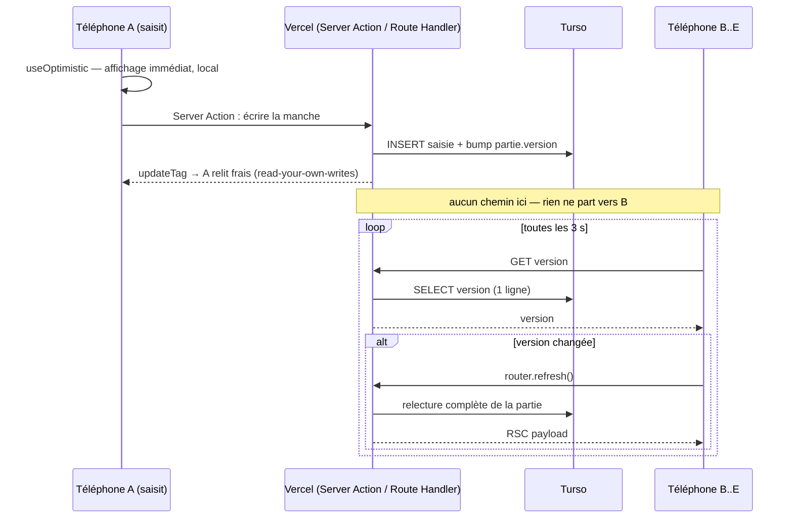

# Transport temps réel sur Vercel + Turso

- **Statut** : recherche, conclut par une recommandation
- **Date** : 2026-08-31 — toutes les pages citées ont été consultées ce jour
- **Ticket** : [Transport temps réel sur Vercel + Turso : les options](https://github.com/Bryan21B/scoring-sheets/issues/4), sous la carte [Carte — feuille de score multi-appareils pour 6 qui prend, Uno et Dnup](https://github.com/Bryan21B/scoring-sheets/issues/1)
- **Débloque** : [Écriture concurrente sur la même case : politique de conflit](https://github.com/Bryan21B/scoring-sheets/issues/12)

## La question

Une manche saisie sur un téléphone doit apparaître sur les quatre autres sans
rechargement. La stack est figée : Next.js 16 App Router (`16.3.0`), React
`19.2.8`, Drizzle + `@libsql/client` `0.17.4`, Turso en prod, Vercel, Bun. Pas
d'authentification, un lien de partage non devinable par partie. Le hors-ligne
est hors périmètre.

Le cadre de dimensionnement, qui décide tout le reste : **cinq clients autour
d'une table, une dizaine d'utilisateurs au total, une soirée de trois heures,
budget gratuit**. Ce n'est pas un problème de débit, c'est un problème de coût
fixe : la bonne réponse est celle qui ajoute le moins de pièces.

Une soirée de référence, utilisée pour tous les calculs ci-dessous : **5 clients,
3 h (10 800 s), ~30 manches, ~150 lignes de saisie en base à la fin**.

## Tableau comparatif

| | Latence | Coût mensuel réel | Pièces ajoutées | Plafond qui saute en premier |
|---|---|---|---|---|
| **Polling client** *(retenu)* | ≤ intervalle (3 s) | 0 € — ~2 % des invocations Vercel Hobby, < 0,01 % des lignes Turso free | aucune | Active CPU Vercel (4 h/mois), non mesuré |
| SSE depuis un Route Handler | ≤ intervalle du poll **serveur** (1 s) | 0 € en théorie — 6 à 30 GB-h de mémoire provisionnée par soirée sur 360 incluses | reconnexion toutes les 5 min, reprise d'état | Provisioned Memory, et le placement des instances n'est pas garanti |
| WebSocket Vercel | idem SSE | idem SSE | idem SSE + un protocole bidirectionnel dont on n'a pas l'usage | idem SSE |
| Notification côté Turso | — | — | — | **n'existe pas** (voir § Turso) |
| Pusher Channels | < 1 s, vrai push | 0 € (Sandbox : 100 connexions, 200 k msg/jour) | 1 compte, 1 secret, 1 SDK client, 1 appel sortant serveur | aucun, à cette échelle |
| Ably | < 1 s | 0 € (6 M msg/mois, 200 connexions) | idem Pusher | aucun |
| Supabase Realtime | < 1 s | 0 € (200 connexions, 2 M msg/mois) | idem + **une seconde base** | projet mis en pause après 1 semaine d'inactivité |
| Liveblocks | < 1 s | 0 € (10 connexions/room) | idem + un modèle de données de collaboration | 3 000 minutes de collaboration/mois |

## 1. SSE sur Vercel

**Les durées, par plan.** Avec fluid compute, une fonction Node.js a pour
`maxDuration` : Hobby **300 s par défaut et 300 s maximum** ; Pro et Enterprise
300 s par défaut, 800 s maximum, 1800 s en maximum étendu (bêta)
([vercel.com/docs/functions/limitations](https://vercel.com/docs/functions/limitations),
`last_updated: 2026-08-24`). Passé le délai, la fonction est terminée avec un 504
`FUNCTION_INVOCATION_TIMEOUT`, et la doc précise que ce délai « includes time
spent processing the request and sending the response, **including streamed
responses** ».

Conséquence non négociable sur Hobby : **une connexion SSE meurt au bout de cinq
minutes**, sans échappatoire par configuration. Sur une soirée de 3 h, c'est 36
reconnexions par client, 180 pour la table. Vercel le dit dans son propre guide
temps réel : « Connections close at maximum duration (300–800 seconds depending
on plan), requiring clients to implement reconnection logic »
([vercel.com/kb/guide/publish-and-subscribe-to-realtime-data-on-vercel](https://vercel.com/kb/guide/publish-and-subscribe-to-realtime-data-on-vercel),
`last_updated: 2026-08-18`).

**Ce que change fluid compute.** Fluid est activé par défaut pour les nouveaux
projets depuis le 23 avril 2025
([vercel.com/docs/fluid-compute](https://vercel.com/docs/fluid-compute),
`last_updated: 2026-08-24`). Il apporte deux choses qui comptent ici.

La première est l'*in-function concurrency* : « multiple invocations can share
the same physical instance (a global state/process) concurrently », disponible
sur les runtimes Node.js et Python. Cinq connexions SSE *peuvent* donc tenir dans
une seule instance. La doc décrit une priorisation — « Vercel Functions
prioritize existing idle resources before allocating new ones » — mais **ne
garantit nulle part le regroupement**. La facture dépend donc d'un comportement
de placement qu'on ne contrôle pas.

La seconde est le modèle de facturation, et c'est là que la question « combien ça
coûte » se tranche
([vercel.com/docs/functions/usage-and-pricing](https://vercel.com/docs/functions/usage-and-pricing),
`last_updated: 2026-06-16`) :

- **Active CPU** — « You are only billed during actual code execution and not
  during I/O operations » ; « Pauses billing when your code is waiting for
  external services ». Une connexion SSE qui attend ne coûte rien en CPU.
- **Provisioned Memory** — « Billed for the entire instance lifetime in
  GB-hours » ; « Memory is reserved for your function even when it's waiting for
  I/O » ; « Billing continues until the last in-flight request completes ».
  **C'est la ligne qui compte pour une connexion longue.**

Le plan Hobby inclut **4 heures d'Active CPU, 360 GB-heures de Provisioned Memory
et 1 million d'invocations par mois** (même page). La mémoire Hobby est de 2 GB
par défaut *et au maximum*
([limitations](https://vercel.com/docs/functions/limitations)).

Le calcul, donc, pour une soirée de 3 h en SSE :

- si les 5 connexions partagent une instance : 2 GB × 3 h = **6 GB-h** →
  60 soirées par mois sur les 360 incluses ;
- si elles atterrissent sur 5 instances : 5 × 2 GB × 3 h = **30 GB-h** →
  12 soirées par mois.

Les deux tiennent. Mais le facteur cinq entre les deux dépend d'un comportement
non documenté, et sur Hobby « if you exceed your usage limits […] you will have
to wait until 30 days have passed before you can use the feature again »
([vercel.com/docs/plans/hobby](https://vercel.com/docs/plans/hobby),
`last_updated: 2026-08-11`). Le mode de défaillance n'est pas une facture, c'est
un mois d'app morte.

**Connexions concurrentes.** Pas un sujet : la concurrence auto-scale « up to
30,000 (Hobby and Pro) »
([limitations](https://vercel.com/docs/functions/limitations)). Il y a en
revanche une limite de **1 024 descripteurs de fichiers partagés entre toutes les
exécutions concurrentes**, connexions réseau incluses — inatteignable à cinq
clients, mais c'est le vrai plafond structurel d'une architecture à connexions
longues sur Vercel.

**Edge ou Node.** Le runtime Edge impose de commencer à répondre en 25 s et peut
streamer jusqu'à 300 s ([limitations](https://vercel.com/docs/functions/limitations)) ;
surtout, l'in-function concurrency n'est disponible que sur Node.js et Python
([fluid-compute](https://vercel.com/docs/fluid-compute)). Et `@libsql/client` +
Drizzle + winston tournent sous Node dans ce repo (`AGENTS.md`, § Gotchas). Rien
ne pousse vers Edge.

**Le fan-out, qui est le vrai problème.** Vercel l'écrit noir sur blanc : « no
two instances share memory, rooms, presence, counters, and pub/sub coordination
should be stored in an external data store »
([guide temps réel](https://vercel.com/kb/guide/publish-and-subscribe-to-realtime-data-on-vercel)).
La fonction qui reçoit la Server Action d'écriture **ne peut pas** prévenir les
fonctions qui tiennent les connexions SSE. Vercel recommande Redis Streams ou un
prestataire managé. Sans store externe, la seule chose qu'une boucle SSE peut
faire pour savoir qu'une manche est arrivée, c'est **interroger la base à
intervalle régulier**.

D'où la conclusion qui décide tout le document : **sur Vercel + Turso, SSE n'est
pas un push, c'est un polling déplacé du téléphone vers la fonction.** Il ne
supprime aucune requête à la base ; il ajoute une facture de mémoire au temps de
connexion, une reconnexion forcée toutes les cinq minutes et une logique de
reprise (`Last-Event-ID`).

**WebSocket.** En public beta depuis le 22 juin 2026, runtime Node.js, `ws` et
Socket.IO supportés, « same limits and pricing as other Function invocations »
([vercel.com/changelog/websocket-support-is-now-in-public-beta](https://vercel.com/changelog/websocket-support-is-now-in-public-beta)).
Donc : même plafond de 300 s sur Hobby, même absence de mémoire partagée entre
instances. Le trafic ici est unidirectionnel — le serveur pousse des scores, la
saisie remonte par une Server Action — et le canal retour n'a aucun usage.
Rien à gagner.

## 2. Polling

**À quelle fréquence.** Les trois seuils de Nielsen (Jakob Nielsen, 1er janvier
1993, [nngroup.com](https://www.nngroup.com/articles/response-times-3-important-limits/))
donnent 0,1 s pour « instantané », 1 s pour « le fil de la pensée n'est pas
interrompu », 10 s pour « l'attention reste sur la tâche ». Ils s'appliquent à la
réaction du système *à sa propre action*, pas à l'arrivée d'une donnée écrite par
quelqu'un d'autre à l'autre bout de la table. **Je n'ai pas trouvé de source
primaire pour un seuil de perception de la propagation entre pairs** — le choix
de 3 secondes est un arbitrage, pas un chiffre sourcé. Il se défend ainsi : le
joueur qui saisit voit son score instantanément (`useOptimistic`) ; les quatre
autres le lisent en levant les yeux d'un jeu de cartes, geste qui dure plus
longtemps que l'intervalle.

**Le volume, à 3 secondes.** 10 800 s / 3 = 3 600 requêtes par client, × 5 =
**18 000 requêtes par soirée** (à 2 s : 27 000).

| Ressource | Soirée à 3 s | Inclus (palier gratuit) | Soirées avant plafond |
|---|---|---|---|
| Invocations Vercel | 18 000 | 1 000 000 / mois | ~55 |
| Turso, lecture naïve (~75 lignes scannées/poll) | ~1,35 M lignes | 500 M / mois | ~370 |
| Turso, lecture par estampille (1 ligne/poll + relecture au changement) | ~40 000 lignes | 500 M / mois | ~12 000 |
| Turso, écritures | ~180 | 10 M / mois | — |
| Active CPU Vercel | **non mesuré** | 4 h / mois | voir ci-dessous |

Les paliers Turso viennent de [turso.tech/pricing](https://turso.tech/pricing)
(plan Free, $0 : **100 bases, 5 GB de stockage, 500 M de lignes lues/mois, 10 M
de lignes écrites/mois, 3 GB de syncs/mois**). La page ne porte **aucune date de
mise à jour** — chiffres consultés le 2026-08-31, à revérifier avant toute
décision qui en dépend.

Une précision qui change les ordres de grandeur : chez Turso, « the term "row
read" actually refers to a "row scan" during statement execution », un `select 1`
compte pour une lecture, et une requête sans index support « incurs a row scan
for each table row »
([docs.turso.tech/help/usage-and-billing](https://docs.turso.tech/help/usage-and-billing)).
D'où l'écart d'un facteur 30 entre les deux lignes du tableau : **poller une
estampille de version sur une seule ligne indexée, et ne relire la partie que
lorsqu'elle bouge**, est ce qui rend le polling gratuit sans discussion.

**Le seul plafond réellement serré est l'Active CPU.** Vercel ne facture pas
l'attente de Turso, mais facture le parsing, le routage Next et la sérialisation
de chaque réponse. À 10 ms d'Active CPU par requête, 18 000 requêtes coûtent 0,05
h → 80 soirées ; à 30 ms, 0,15 h → 26 soirées. **Ces deux chiffres sont des
estimations, pas des sources** : je n'ai trouvé aucune mesure primaire du coût
CPU d'un Route Handler Next 16 faisant une requête libSQL. C'est le seul chiffre
du dossier à mesurer avant de s'engager — un déploiement et une soirée réelle
suffisent, l'onglet Usage de Vercel donne la réponse.

**La mémoire provisionnée est négligeable en polling**, contrairement à SSE :
« After all requests complete, the instance is paused, and no CPU or memory
charges apply until the next invocation »
([usage-and-pricing](https://vercel.com/docs/functions/usage-and-pricing)). On ne
paie que la durée des requêtes, pas la durée de la soirée.

**Le piège de cache à ne pas rater.** « Route Handlers are not cached by
default », mais avec Cache Components activé un `GET` « follows the same model as
normal UI routes […] can be prerendered when they don't access uncached or
runtime data ». Heureusement, « Prerendering stops if the `GET` handler accesses
network requests, **database queries** […] »
([nextjs.org/docs/app/getting-started/route-handlers](https://nextjs.org/docs/app/getting-started/route-handlers),
v16.3.3, `lastUpdated: 2026-03-03`). Une route de poll qui lit Turso est donc
dynamique par construction — à condition de **ne jamais** envelopper cette
lecture dans `use cache`.

## 3. Turso / libSQL : y a-t-il un push côté base ?

**Non.** Trois pistes, trois impasses, dans l'ordre où on les rencontre.

**Réplicas embarqués.** « Reads are always served from the local replica
configured at `url` », « Writes are sent to the remote primary database
configured at `syncUrl` ». La synchronisation est explicitement tirée : on
appelle `.sync()` à la main, ou on passe `syncInterval` pour la déclencher
périodiquement
([docs.turso.tech/features/embedded-replicas/introduction](https://docs.turso.tech/features/embedded-replicas/introduction)).
Aucune notification du serveur vers le client. Et de toute façon, un réplica
embarqué est un fichier local — le système de fichiers de Vercel est éphémère
(`docs/adr/0002`), le réplica serait reconstruit à chaque instance froide.

**CDC (change data capture).** Il existe, et il est documenté :
`PRAGMA capture_data_changes_conn('off' | 'id' | 'before' | 'after' | 'full')`,
qui écrit les changements ligne à ligne dans une table `turso_cdc`
([docs.turso.tech/sql-reference/pragmas](https://docs.turso.tech/sql-reference/pragmas)).
Mais c'est **un journal qu'on lit en SQL, pas un canal qui appelle** : Turso le
présente comme « You can query, maintain, and clean them up with standard SQL »
([turso.tech/blog, 16 juillet 2025](https://turso.tech/blog/introducing-change-data-capture-in-turso-sqlite-rewrite)).
Deux réserves de plus : l'annonce le rattache à la **réécriture Rust de Turso**
(« Turso's SQLite rewrite », v0.1.2 unstable à l'époque), et la doc d'introduction
distingue toujours deux produits — « Turso Database (Embedded) » et « Turso
Cloud », ce dernier décrit comme gérant « Turso **and libSQL** databases »
([docs.turso.tech/introduction](https://docs.turso.tech/introduction)).
**Je n'ai pas trouvé de source primaire affirmant que ce pragma est disponible
sur la base Turso Cloud vers laquelle `DATABASE_PATH` pointe en prod.** À traiter
comme indisponible tant que ce n'est pas vérifié sur la base réelle.

**Client libSQL.** Un endpoint `/listen` en bêta existe côté serveur libSQL, mais
le client TypeScript n'expose aucune API pour s'y abonner : l'issue de design
[tursodatabase/libsql-client-ts#243](https://github.com/tursodatabase/libsql-client-ts/issues/243),
ouverte le 29 juillet 2024, est toujours ouverte, et bute sur l'absence de
support natif SSE avec en-têtes d'autorisation côté Node. Rien à consommer
aujourd'hui depuis `@libsql/client` `0.17.4`.

**Conclusion tranchée : la base ne préviendra jamais personne.** Toute
architecture temps réel sur cette stack part d'une lecture répétée — la seule
question est de savoir *qui* répète, le téléphone ou la fonction.

## 4. Les tiers

Tous ont un palier gratuit qui couvre cinq clients sans discussion. La question
n'est donc pas la capacité, c'est ce que la dépendance coûte.

| | Palier gratuit | Consulté |
|---|---|---|
| **Pusher Channels** (Sandbox) | 100 connexions simultanées, 200 000 messages/jour ; palier suivant $49/mois | [pusher.com/channels/pricing](https://pusher.com/channels/pricing/) |
| **Ably** (Free) | 6 M messages/mois, 200 connexions simultanées, 200 canaux simultanés ; Standard à $29/mois + usage | [ably.com/pricing](https://ably.com/pricing) |
| **Supabase** (Free) | Realtime : 200 connexions simultanées, 2 M messages/mois ; base 500 MB ; **projets mis en pause après 1 semaine d'inactivité**, 2 projets actifs max ; Pro à $25/mois | [supabase.com/pricing](https://supabase.com/pricing) |
| **Liveblocks** (Free) | 10 connexions simultanées par room, 3 000 connexions anonymes/mois, **3 000 minutes de collaboration/mois**, rétention 24 h ; Pro à $30/mois | [liveblocks.io/pricing](https://liveblocks.io/pricing) |

Deux disqualifications immédiates. **Supabase** met le projet en pause après une
semaine d'inactivité : une app jouée une fois par mois se réveille froide, et la
première partie de la soirée tombe sur un projet en pause. Il faudrait en plus
tenir une seconde base à côté de Turso pour ne s'en servir que comme d'un bus de
messages. **Liveblocks** plafonne à 3 000 minutes de collaboration par mois —
si ce compteur est en utilisateur-minute (5 clients × 180 min = 900 min par
soirée), cela ne fait que **trois soirées par mois**. La page ne définit pas la
métrique et je n'ai pas trouvé de source primaire qui la définisse : incertitude
assumée, mais c'est un plafond trop proche pour qu'on s'y expose.

Restent Pusher et Ably, tous deux confortables. Leur coût réel n'est pas
financier :

- **un compte et un secret de plus.** `AGENTS.md` § Security dit qu'au premier
  secret réel, 1Password entre dans la boucle. Aujourd'hui le projet n'a aucun
  secret applicatif ; une clé Pusher en crée un, plus une clé publique côté
  client, plus deux variables dans `src/lib/env.ts` et `.env.example` (que le
  hook pre-commit vérifie synchrones) ;
- **un SDK client dans le bundle**, sur une app qu'on ouvre debout sur un
  téléphone en 4G ;
- **une seconde source de vérité.** Le message poussé peut diverger de la base :
  message perdu, message dans le désordre, message reçu avant que la transaction
  ne soit visible. Il faut alors décider si le client croit le message ou s'il
  relit — et s'il relit, on a payé la dépendance pour ne garder que le signal de
  réveil.

C'est une architecture correcte, mais elle achète une latence sous la seconde
pour un usage qui n'en a pas besoin.

## 5. Ce que Next 16 / React 19 apportent — et n'apportent pas

Le point à trancher tient en une phrase de la doc `revalidateTag` : « **A
revalidation is triggered by a request, not by the `revalidateTag` call**, so
pages using the tag revalidate as they are visited rather than all at once »
([nextjs.org/docs/app/api-reference/functions/revalidateTag](https://nextjs.org/docs/app/api-reference/functions/revalidateTag),
v16.3.3, `lastUpdated: 2026-08-25`).

**Non. Rien dans Next 16 ou React 19 n'invalide le cache d'un autre client.**
Toutes ces API sont serveur-locales ou requête-locales ; la propagation vers un
autre appareil suppose toujours que cet appareil redemande quelque chose.

| API | Ce qu'elle fait | Ce qu'elle ne fait pas |
|---|---|---|
| `revalidateTag` | marque une entrée de cache serveur comme périmée ; la revalidation part **à la prochaine requête** | ne touche aucun client |
| `updateTag` | Server Actions uniquement, « designed for **read-your-own-writes** scenarios » ([doc](https://nextjs.org/docs/app/api-reference/functions/updateTag)) | conçu pour que l'auteur de l'écriture voie sa modification — explicitement pas les autres |
| `useOptimistic` | « Optimistic state only renders while an Action is in progress » ([react.dev](https://react.dev/reference/react/useOptimistic)) | état local au composant du saisisseur ; les autres téléphones ne voient rien |
| Streaming / Suspense / PPR | découpe **une** réponse en morceaux qui arrivent au fil de l'eau | le flux se termine avec la réponse ; ce n'est pas un canal |
| Cache Components / `use cache` | met en cache un rendu ; par défaut « a per-instance, in-memory store that is ephemeral on serverless », et tous les stores sont « scoped to a single deployment » ([doc](https://nextjs.org/docs/app/getting-started/caching)) | ne notifie rien ; **sur une lecture de partie, c'est un piège actif** — un cache y sert du périmé aux autres joueurs |
| `router.refresh()` | « Making a new request to the server, re-fetching data requests, and re-rendering Server Components. The client will merge the updated React Server Component payload **without losing unaffected client-side React (e.g. `useState`) or browser state** » ([doc](https://nextjs.org/docs/app/api-reference/functions/use-router), v16.3.3) | est déclenché **par le client** — c'est le mécanisme de poll, pas une alternative au poll |

`router.refresh()` mérite d'être souligné : c'est exactement l'outil de poll qu'on
veut, parce qu'il rafraîchit l'arbre serveur **sans détruire l'état du formulaire
de saisie en cours**. Un joueur qui tape sa manche pendant qu'un autre valide la
sienne ne perd pas ce qu'il a saisi.

La flèche qui manque au milieu du diagramme est tout le sujet du ticket.

## Recommandation

**Polling client à 3 secondes, sur une estampille de version, avec
`router.refresh()` conditionnel.** Concrètement : un Route Handler
`GET /api/parties/[jeton]/version` qui lit une seule ligne indexée, un
`setInterval` côté client, et `router.refresh()` seulement quand la valeur
change. Écriture par Server Action, `useOptimistic` pour le retour immédiat au
saisisseur, `updateTag` pour son read-your-own-writes.

Quatre raisons, dans cet ordre.

1. **Ça n'ajoute aucune pièce.** Pas de compte, pas de secret, pas de SDK, pas de
   seconde source de vérité. Tout tient dans la stack figée par le cadrage. À
   dix utilisateurs, le coût dominant d'une architecture est le nombre de choses
   qui peuvent tomber en panne un vendredi soir.
2. **Le coût est deux ordres de grandeur sous les plafonds** : ~18 000
   invocations et ~40 000 lignes lues par soirée, contre 1 M d'invocations et
   500 M de lignes par mois inclus.
3. **SSE ne supprime pas le polling, il le déplace.** Turso ne pousse rien
   (§ 3) et deux instances Vercel ne partagent pas de mémoire (§ 1) : une boucle
   SSE interroge la base exactement comme le ferait un téléphone. On paierait
   donc de la mémoire provisionnée pendant toute la soirée, plus une reconnexion
   forcée toutes les cinq minutes, pour gagner au mieux deux secondes.
4. **Le mode de défaillance est le bon.** Un téléphone verrouillé arrête de
   poller et reprend au réveil, sans qu'on écrive une ligne pour ça. Une
   connexion SSE coupée demande une reprise (`Last-Event-ID`), un état de
   « manqué pendant la coupure », et une politique de rattrapage.

**Ce que ça coûte, en euros : zéro**, et la marge est confortable partout sauf
sur une ligne. Le seul chiffre à surveiller est l'**Active CPU de Vercel Hobby
(4 h/mois)**, pour lequel je n'ai pas de mesure primaire : entre 26 et 80 soirées
par mois selon le coût CPU réel d'une requête, qu'une soirée réelle et l'onglet
Usage suffiront à trancher. À noter aussi que Hobby est réservé à un usage
personnel non commercial ([plans/hobby](https://vercel.com/docs/plans/hobby)) —
ce qui est le cas — et qu'un dépassement se paie d'un blocage de 30 jours, pas
d'une facture.

**Plan B, dans l'ordre où on les tente.**

- *Si 3 s est perçu comme trop lent* : descendre à 1,5 s. Le coût double et
  reste deux ordres de grandeur sous les plafonds. C'est un changement d'une
  constante, sans architecture.
- *Si l'Active CPU devient le plafond qui saute* : remonter l'intervalle à 5 s
  hors saisie active (la page ne poll vite que quand un formulaire est ouvert),
  et alléger la route de version jusqu'à une seule ligne lue.
- *Si le besoin de latence devient réel* : **Pusher Sandbox** (100 connexions,
  200 000 messages/jour), déclenché depuis la Server Action, en **signal de
  réveil uniquement** — le message dit « la partie a bougé », le client relit
  par le chemin déjà en place. Le polling reste alors comme filet, à intervalle
  long. C'est un ajout, pas une réécriture, et c'est ce qui rend ce plan B bon
  marché.
- *Ce qui n'est jamais le plan B* : Supabase (pause après une semaine),
  Liveblocks (plafond de minutes), WebSocket Vercel (mêmes limites que SSE, sans
  le bénéfice).

## Conséquences pour la suite

### Ce que le transport rend observable, et à quelle latence

C'est l'entrée directe de [Écriture concurrente sur la même case : politique de
conflit](https://github.com/Bryan21B/scoring-sheets/issues/12).

- **Rien n'est poussé.** Un client ne découvre un changement qu'en le demandant.
  **Latence de propagation : jusqu'à 3 secondes** (l'intervalle) plus le
  round-trip ; pire cas réaliste, une requête ratée et l'intervalle suivant,
  soit ~6 s.
- **Pas d'écriture partielle observable.** Le poll lit un état validé, pas un
  flux d'événements. Les autres joueurs ne voient jamais « en train de saisir » :
  ils voient un avant et un après.
- **Pas de présence.** Aucun client ne sait qui d'autre est connecté ni qui est
  en train de saisir. Une politique de conflit **ne peut donc pas** reposer sur
  un verrou d'édition, ni sur un avertissement « X modifie cette manche ».
- **Pas d'ordre observable côté client.** Deux saisies concurrentes arrivent au
  serveur dans l'ordre où elles y arrivent, et les clients ne découvrent le
  résultat qu'au poll suivant. **La politique de conflit doit être résolue côté
  serveur, à l'écriture** — jamais négociée entre clients.
- **Fenêtre de collision de 3 secondes.** Deux téléphones peuvent saisir la même
  case sans le savoir. Un « dernier écrit gagne » y perdrait une saisie
  silencieusement, sans que personne ne le voie passer. Cela plaide pour une
  **écriture conditionnelle sur l'estampille de version** — celle-là même que le
  poll lit déjà — plutôt qu'un merge.
- **Le retour est asymétrique.** `useOptimistic` + `updateTag` donnent au
  saisisseur un affichage instantané ; les autres attendent leur poll. #12 doit
  donc trancher ce qui se passe **quand cet optimisme est démenti** par un rejet
  serveur : le score affiché doit revenir en arrière sur le téléphone qui a
  perdu, et ce recul doit être compris.

### Ce que ça impose ailleurs

- **Une estampille de version par partie**, incrémentée à chaque écriture, doit
  entrer dans le schéma. Elle sert deux fois : elle rend le poll gratuit
  (une ligne lue au lieu de la partie entière) et elle donne à #12 son jeton
  d'écriture conditionnelle. À porter dans
  [Modèle de domaine et schéma Drizzle](https://github.com/Bryan21B/scoring-sheets/issues/15).
- **Interdiction de `use cache` sur la lecture d'une partie.** Un cache partagé
  y sert du périmé aux autres joueurs, et le mécanisme d'invalidation ne les
  atteint pas (§ 5). À graver dans `AGENTS.md` § Gotchas au moment de coder la
  page de partie.
- **Aucun secret nouveau**, donc 1Password reste hors de la boucle locale tant
  que `TURSO_AUTH_TOKEN` n'est pas réel (`AGENTS.md` § Setup).
- **Rien à décider ici sur le lien de partage** : le jeton de partie reste le
  sujet de [Identité, lien de partage et arrivée dans une
  partie](https://github.com/Bryan21B/scoring-sheets/issues/3). Le transport
  s'appuie dessus, il ne le contraint pas.

## Ce qui n'est pas sourcé, et qu'il faut mesurer ou vérifier

Par honnêteté sur la solidité du dossier :

- **Le coût en Active CPU d'un Route Handler Next 16 + une requête libSQL.**
  Aucune source primaire trouvée ; les 10–30 ms utilisés sont une estimation.
  C'est le seul chiffre qui peut faire sauter un plafond. Une soirée réelle et
  l'onglet Usage de Vercel le tranchent.
- **Le regroupement de plusieurs connexions SSE sur une instance fluid.** La doc
  décrit une priorisation des instances inactives, jamais une garantie. Facteur
  cinq sur la mémoire provisionnée.
- **La disponibilité du pragma CDC sur Turso Cloud**, par opposition à la
  réécriture Rust. La doc ne le dit pas. Vérifiable en une requête sur la base
  réelle — mais sans client capable de s'abonner, ça ne change pas la conclusion.
- **La définition d'une « minute de collaboration » chez Liveblocks.** Non
  documentée sur la page de prix. Écarte l'option par prudence, sans la
  démontrer fausse.
- **La date de mise à jour de [turso.tech/pricing](https://turso.tech/pricing).**
  La page n'en porte aucune. Chiffres consultés le 2026-08-31, à revérifier —
  les paliers gratuits bougent, et celui-ci porte la moitié de l'argument.
