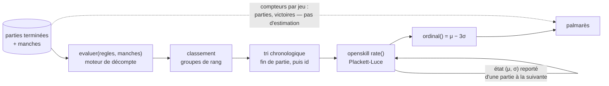

# Classement multijoueur pour des parties à 2-6 joueurs

- **Statut** : recherche, conclut par une recommandation
- **Date** : 2026-09-04 — toutes les pages, versions npm et mesures citées datent
  de ce jour
- **Ticket** : [Classement multijoueur : quelle formule pour une partie à 2-6 joueurs](https://github.com/Bryan21B/scoring-sheets/issues/5), sous la carte [Carte — feuille de score multi-appareils pour 6 qui prend, Uno et Dnup](https://github.com/Bryan21B/scoring-sheets/issues/1)
- **Débloque** : [Historique et palmarès : les pages et leurs agrégats](https://github.com/Bryan21B/scoring-sheets/issues/14)
- **Alimente** : [Design doc consolidé, CONTEXT.md et ADR](https://github.com/Bryan21B/scoring-sheets/issues/16),
  et [Cycle de vie d'une partie : abandon, reprise, correction, fin](https://github.com/Bryan21B/scoring-sheets/issues/13)
  pour la définition de « partie terminée », qui est l'entrée du calcul

## Résumé

**Retenu : Weng-Lin / Plackett-Luce, via `openskill` (npm, MIT), une seule note
globale par joueur, recalculée en rejouant l'historique chronologique.**

| | Valeur | Source |
|---|---|---|
| Paquet | `openskill@5.0.1` | [registry.npmjs.org/openskill](https://registry.npmjs.org/openskill) |
| Licence | MIT | idem, et [LICENSE](https://github.com/philihp/openskill.js/blob/main/LICENSE) |
| Modèle | Plackett-Luce (défaut de la lib) | [README](https://github.com/philihp/openskill.js) |
| μ₀ | 25 | Weng & Lin 2011, § 6.1 |
| σ₀ | 25/3 ≈ 8,3333 | idem |
| β | 25/6 ≈ 4,1667 | idem |
| τ | 25/300 ≈ 0,0833 (défaut v5) | `dist/constants.js` |
| κ | 0,0001 | Weng & Lin 2011, § 6.1 |
| Affichage | `ordinal()` = μ − 3σ | README, et `z = 3` dans `constants.js` |
| Ex æquo | même valeur de `rank` | README + Weng & Lin 2011, éq. (71) |
| Ordre de rejeu | chronologique sur la fin de partie, départagé par id | ce document, § 10 |
| Coût du rejeu | 17 ms pour 1 000 parties sous Bun, 26 ms sous Node | mesuré, § 5 |

Et la phrase qu'il faut lire avant la formule : **à dix joueurs, aucune formule
ne produit un classement fiable.** Sur un historique d'une quarantaine de
parties — soit à peu près une année de jeu — la meilleure des quatre candidates
désigne le bon joueur en tête **moins d'une fois sur deux**, alors même que la
simulation lui donne une vraie hiérarchie à retrouver (§ 1). Ce que la formule
achète, ce n'est pas de la précision : c'est de la **robustesse au calendrier**
— la capacité à ne pas se faire berner par le fait que Paul joue surtout contre
Marie et Marie surtout contre Jean — et une **mesure d'incertitude** qui permet à
l'écran de dire « pas encore assez de parties » au lieu d'afficher un chiffre
faux avec aplomb.

## La question

Quatre entrées au catalogue, des parties à 2-6 joueurs, chacun contre tous, et
trois échelles de score sans rapport entre elles. Le seul signal comparable d'un
jeu à l'autre est le **classement** — que `CONTEXT.md` définit déjà comme « un
ordre en groupes de rang », où « deux joueurs à égalité sont dans le même groupe »
et où « l'égalité n'est jamais départagée ». C'est exactement l'entrée qu'attend
un système de notation multijoueur : un vecteur de rangs, avec ex æquo autorisés.

L'objection du ticket — « un jeton Dnup n'a rien à voir avec une tête de bœuf » —
**se dissout donc d'elle-même** : aucune des formules examinées ici ne voit un
score. Elles voient un ordre. Ce qui reste de l'objection, et qui est réel, c'est
que les quatre jeux ne récompensent pas les mêmes qualités ; c'est la question de
granularité, tranchée en § 8.

### Le cadre de dimensionnement, qui décide presque tout

Comme pour le transport temps réel, la bonne réponse est bornée par la taille du
problème, pas par la théorie.

- **Dix joueurs, jamais plus** (cadrage de la carte).
- Une soirée de jeu produit de l'ordre de **5 à 8 parties**. À une soirée par
  mois, cela fait **60 à 100 parties par an**, tous jeux confondus.
- Une partie réunit 4 joueurs en moyenne. Cela fait ~350 « participations » par
  an, soit **une trentaine de parties par joueur et par an**, toutes entrées du
  catalogue mélangées.
- Réparties sur quatre entrées : **7 à 9 parties par joueur et par entrée et par
  an**.

Ce dernier chiffre est à comparer à la seule recommandation chiffrée qu'une
source primaire donne sur le sujet. Glickman, pour Glicko-2 :

> The Glicko-2 system works best when the number of games in a rating period is
> moderate to large, say an average of at least 10-15 games per player in a
> rating period.
>
> — [glicko.net/glicko/glicko2.pdf](http://www.glicko.net/glicko/glicko2.pdf),
> révisé le 22 mars 2022

Une note par (joueur, jeu) n'atteindrait donc pas, **en un an entier**, le volume
d'une seule période de notation.

## 1. Ce qu'aucune formule ne peut livrer à cette échelle

Aucune source primaire ne dit ce que vaut un classement à dix joueurs et
quarante parties. Je l'ai donc mesuré, et **c'est une simulation à moi, pas une
source** — méthode et limites explicitées pour qu'on puisse la refaire ou la
contester.

**Méthode.** Dix joueurs dotés d'une force vraie espacée régulièrement (0 à 2,7),
et une performance de partie tirée uniformément dans ±3,0 autour de cette force —
c'est-à-dire un bruit deux fois plus large que l'écart total entre le meilleur et
le pire. C'est délibéré : dans un jeu de cartes entre amis, la donne pèse plus
lourd que le talent. Chaque partie tire 2 à 6 joueurs au hasard, les classe par
performance, et l'historique est rejoué par la formule. On mesure le **ρ de
Spearman** entre le classement produit et la vraie hiérarchie, et le taux de fois
où le vrai meilleur joueur finit en tête. 200 à 300 tirages par ligne.

**Résultat, avec `openskill` en Plackett-Luce et un calendrier équilibré :**

| Parties dans l'historique | ρ de Spearman | Vrai meilleur en tête | σ moyen |
|---|---|---|---|
| 10 | 0,592 | 34 % | 7,70 |
| 20 | 0,703 | 37 % | 7,17 |
| 40 | 0,801 | 44 % | 6,31 |
| 80 | 0,884 | 56 % | 5,12 |
| 160 | 0,920 | 61 % | 3,82 |
| 320 | 0,950 | 76 % | 2,74 |
| 640 | 0,969 | 79 % | 2,06 |

Trois lectures, dans l'ordre d'importance.

1. **À 40 parties — une année de jeu — le classement se trompe de tête une fois
   sur deux.** Le hasard pur donnerait 10 % ; on est à 44 %. C'est informatif,
   ce n'est pas fiable. Un palmarès qui affiche « 1er : Paul » sans nuance
   affirme quelque chose que les données ne portent pas.
2. **La forme large du classement, elle, est bonne** : ρ = 0,80 signifie que le
   tiers de tête et le tiers de queue sont à peu près les bons. « Qui est dans
   les meilleurs » est une question à laquelle on peut répondre ; « qui est le
   meilleur » ne l'est pas.
3. **σ décroît lentement.** Parti de 8,33, il est encore à 6,3 après 40 parties.
   C'est précisément ce que la formule sait de sa propre ignorance, et c'est la
   chose la plus utile qu'elle produise à cette taille d'échantillon.

## 2. Le tableau comparatif

| | Multijoueur natif | Ex æquo | Implémentation JS | Licence | Coût du rejeu complet |
|---|---|---|---|---|---|
| **Weng-Lin / Plackett-Luce** *(retenu)* | oui, par construction | natifs, éq. (71) du papier | `openskill@5.0.1`, MIT, publié 2026-06-08 | MIT, sans réserve | 17 ms / 1 000 parties |
| Elo par paires | non — n(n−1)/2 duels synthétiques | 0,5 par convention | `@ihs7/ts-elo@2.0.0` ou 40 lignes à écrire | MIT | 3,9 ms / 1 000 parties |
| TrueSkill | oui | oui, `draw_probability` | `ts-trueskill@5.1.0`, dernier publish 2024-11-01 | MIT sur le code, **marque restreinte** | non mesuré, ~10× plus lent (Weng & Lin, § 6.1) |
| Glicko-2 | **non** — 1v1 par construction | 0,5 par convention | `glicko2@1.2.2`, MIT, publié 2026-08-21 | domaine public | non pertinent |
| Taux de victoires normalisé | oui (trivialement) | rang moyen | rien à installer | — | négligeable |

## 3. Elo par paires

### Ce que c'est, et ce qui est vrai dans l'argument du ticket

Une partie à *n* joueurs se développe en *n*(*n*−1)/2 confrontations, chacune
traitée par la formule Elo standard, les deltas étant sommés avant d'être
appliqués. Le ticket a raison sur deux points, et ils comptent.

**La dégénérescence à deux joueurs est exacte.** À *n* = 2, il y a une seule
paire : c'est Elo, littéralement, sans cas particulier. Le cas « Dnup à deux »
est traité par le même code que le reste.

**La formule est sourcée et stable.** Elle est dans le règlement FIDE, qui donne
aussi les seules valeurs de K jamais publiées par une fédération
([handbook.fide.com/chapter/B022024](https://handbook.fide.com/chapter/B022024),
en vigueur au 1er mars 2024) :

> K = 40 for a player new to the rating list until they have completed events
> with at least 30 games.
>
> K = 20 as long as a player's rating remains under 2400.
>
> K = 10 once a player's published rating has reached 2400 […]

Elle est aussi **exactement conservative** : la somme des notes ne bouge jamais.
Vérifié — sur 200 historiques de 160 parties, la somme des dix notes vaut
15 000,0 à chaque fois. C'est une propriété agréable pour un palmarès entre amis :
personne ne gagne de points sans que quelqu'un en perde.

### Le piège que le ticket ne mentionne pas : K est multiplié par (n−1)

Dans le développement par paires, un joueur d'une partie à 6 subit **cinq**
mises à jour de magnitude K, contre **une** dans un duel. À K constant, une
partie à 6 déplace donc les notes cinq fois plus qu'une partie à 2 — sans qu'aucune
information supplémentaire ne le justifie.

Mesuré sur le même générateur qu'au § 1 :

| | 10 parties | 40 parties | 160 parties |
|---|---|---|---|
| K = 16 brut | ρ 0,596 | ρ 0,800 | ρ 0,878 |
| K = 32 brut | ρ 0,583 | ρ 0,752 | **ρ 0,800** |
| K = 16 divisé par (n−1) | ρ 0,605 | ρ 0,822 | **ρ 0,943** |
| K = 32 divisé par (n−1) | ρ 0,604 | ρ 0,815 | ρ 0,919 |

La ligne à regarder est la troisième colonne : **sans normalisation, la qualité
se dégrade quand l'historique s'allonge** (0,878 à K = 16, 0,800 à K = 32), parce
que le pas de mise à jour reste trop grand pour que la note se stabilise. Avec la
division par (n−1), K = 16 atteint ρ = 0,943 et 70 % de têtes correctes à 160
parties — le meilleur chiffre de tout ce document.

C'est une bonne nouvelle et un avertissement : **Elo par paires bien réglé est
compétitif**, mais il a un réglage qui n'est écrit nulle part et qu'on peut rater
sans que rien ne le signale.

### La bibliothèque disponible se trompe précisément là-dessus

`@ihs7/ts-elo` (2.0.0, MIT, publié le 2025-09-13, 580 téléchargements/mois,
[npm](https://registry.npmjs.org/@ihs7/ts-elo)) expose un
`calculateFreeForAll` qui est exactement ce développement par paires. Son code
publié, lu dans le tarball :

```js
for (const otherPlayerScore of playersWithScores) {
  if (playerScore.player.id === otherPlayerScore.player.id) continue;
  const expected = calculateExpectedScore(playerScore.player.rating, otherPlayerScore.player.rating);
  let actual;
  if (playerScore.score > otherPlayerScore.score) actual = 1;
  else if (playerScore.score === otherPlayerScore.score) actual = 0.5;
  else actual = 0;
  totalRatingChange += kFactor * (actual - expected);
}
const finalChange = Math.sign(totalRatingChange) * Math.round(Math.abs(totalRatingChange));
```

Trois défauts, tous visibles dans ces huit lignes :

1. **Aucune division par (n−1)** — c'est la ligne « K brut » du tableau ci-dessus.
2. **`Math.round` sur le delta total**, ce qui casse la conservation exacte et,
   avec un K petit, avale purement et simplement les petits ajustements.
3. **L'entrée est un `score`, pas un rang.** Il faudrait fabriquer des scores
   décroissants synthétiques depuis un classement qu'on a déjà — un aller-retour
   inutile, et une occasion de se tromper de direction sur *6 qui prend*, où le
   plus bas gagne.

Les ex æquo, eux, sont corrects (`actual = 0.5`). Mais au total : à 40 lignes de
code, cette dépendance ne fait pas gagner de temps, elle fait hériter de trois
décisions discutables.

### Ce qu'Elo ne donnera jamais

**Aucune mesure d'incertitude.** Un joueur qui a fait trois parties et un joueur
qui en a fait quarante ont tous deux « un nombre », et rien dans le nombre ne dit
lequel des deux est une supposition. À dix joueurs, avec des participations très
inégales, c'est le défaut qui coûte le plus cher.

## 4. TrueSkill

### La partie technique n'est pas le problème

Le papier fondateur est explicite sur les deux points qui nous intéressent
(Herbrich, Minka, Graepel, *TrueSkill™: A Bayesian Skill Rating System*, NIPS 20,
MIT Press, 2007,
[microsoft.com/en-us/research/publication](https://www.microsoft.com/en-us/research/publication/trueskilltm-a-bayesian-skill-rating-system/)) :

> We present a new Bayesian skill rating system which can be viewed as a
> generalisation of the Elo system used in Chess. The new system tracks the
> uncertainty about player skills, **explicitly models draws, can deal with any
> number of competing entities** and can infer individual skills from team
> results.

C'est exactement le cahier des charges du ticket. Le problème est ailleurs.

### Le brevet a expiré — et ce n'est pas ce qu'on croyait

La question « Licence ? » du ticket appelle une réponse en deux temps, et la
première a changé récemment.

**Les brevets sont expirés.** Le noyau de la famille, *Bayesian scoring*
(Graepel & Herbrich, cédé à Microsoft Technology Licensing LLC) :

| Brevet | Priorité | Statut Google Patents | Expiration |
|---|---|---|---|
| [US7050868B1](https://patents.google.com/patent/US7050868B1/en) | 2005-01-24 | « Expired - Lifetime » | 2025-01-24 |
| [US7376474B2](https://patents.google.com/patent/US7376474B2/en) | 2005-01-24 | « Expired - Fee Related » | 2025-05-06 |
| [US8583266B2](https://patents.google.com/patent/US8583266B2/en) *(Seeding in a skill scoring framework)* | 2005-01-24 | « Expired - Fee Related » | 2025-01-24 |

**Ce qui reste est la marque, et là je n'ai pas de source primaire.** La
restriction citée partout vient des portages, pas de Microsoft. Heungsub Lee, sur
[trueskill.org](https://trueskill.org/) (paquet Python 0.4.5, dont dérive le
portage TypeScript) :

> This TrueSkill package is opened under the BSD license but the TrueSkill™ brand
> is not. Microsoft permits only Xbox Live games or non-commercial projects to
> use TrueSkill™. If your project is commercial, you should find another rating
> system.

Reprise mot pour mot dans le README de `ts-trueskill`. **La page officielle de
Microsoft Research sur TrueSkill ne porte aucune mention de licence, de brevet ni
de restriction d'usage** — vérifié le 2026-09-04 sur
[microsoft.com/en-us/research/project/trueskill-ranking-system](https://www.microsoft.com/en-us/research/project/trueskill-ranking-system/) ;
la seule phrase touchant à l'ouverture y est « Microsoft has open-sourced the
Infer.NET library which can perform TrueSkill updates, but it requires some
coding ». **Je n'ai pas vérifié le statut de la marque déposée** auprès de
l'USPTO.

Ce que ça change concrètement : un projet non commercial entre dix amis n'est de
toute façon pas dans la zone à risque, même en lisant la restriction au plus
strict. **La licence n'est donc pas ce qui écarte TrueSkill ici** — contrairement
à ce que le ticket suppose.

### Ce qui l'écarte : le portage, et la vitesse

`ts-trueskill@5.1.0` — MIT au champ `license` de npm, mais `NOASSERTION` côté
GitHub, ce qui reflète le double régime code/marque ci-dessus. 10 926
téléchargements par mois, 84 étoiles, 4 issues ouvertes. **Dernier publish et
dernier push : 2024-11-01**, soit près de deux ans d'immobilité. Trois
dépendances runtime (`mathjs`, `ts-gaussian`, `uuid`), dont `mathjs`, qui est un
moteur de calcul symbolique complet pour ce qui se réduit à une poignée
d'opérations gaussiennes.

Et la mesure des auteurs de l'alternative, sur le jeu de données *Free for All*
de Microsoft — 5 943 parties, 60 022 joueurs, jusqu'à 8 joueurs par partie :

> On the same computer, TrueSkill takes 13 seconds to run the "Free for All"
> data, but BT-full needs only 1.2 seconds. Our method is more efficient because
> it uses analytic update rules. In contrast, TrueSkill requires an iterative
> procedure. Moreover, it is simpler to implement our update rules. Using F#, our
> code takes less than 100 lines, but TrueSkill needs more than 500 lines.
>
> — Weng & Lin 2011, § 6.1

Pour une contrainte « recalculé à la volée à chaque lecture », un facteur 10 sur
le temps de rejeu est le mauvais côté du choix. Et la précision ne le compense
pas : sur ce même jeu de données, l'erreur de prédiction est de 30,82 % pour
TrueSkill contre 30,59 % pour BT-full et 31,74 % pour Plackett-Luce (Table 2 du
papier). **Les trois sont équivalents.**

Le paquet `trueskill` (0.0.2, 2013, **aucun champ de licence**) est mort et ne
mérite pas d'être considéré.

## 5. Weng-Lin / Plackett-Luce — `openskill` *(retenu)*

### La source

Ruby C. Weng et Chih-Jen Lin, *A Bayesian Approximation Method for Online
Ranking*, **Journal of Machine Learning Research 12 (2011) 267-300**, éditeur :
Thore Graepel — l'un des trois auteurs de TrueSkill
([csie.ntu.edu.tw/~cjlin/papers/online_ranking/online_journal.pdf](https://www.csie.ntu.edu.tw/~cjlin/papers/online_ranking/online_journal.pdf)).
Résumé :

> This paper describes a Bayesian approximation method to obtain online ranking
> algorithms for games with multiple teams and multiple players. […] We consider
> game models in which a k-team game is treated as several two-team games. By
> approximating the expectation of teams' (or players') performances, we derive
> simple analytic update rules. These update rules, without numerical
> integrations, are very easy to interpret and implement. Experiments on game
> data show that the accuracy of our approach is competitive with state of the
> art systems such as TrueSkill, but the running time as well as the code is much
> shorter.

Le papier pose aussi, en une phrase, pourquoi Elo et Glicko sont hors sujet ici :

> Though the Elo and Glicko ranking systems have been successful, they are
> designed for two-player games. In video games a game often involves more than
> two players or teams.

### Les ex æquo sont dans le modèle, pas dans une convention

C'est la différence de fond avec Elo et Glicko, qui traitent l'égalité comme
« une demi-victoire plus une demi-défaite ». Weng & Lin généralisent la
vraisemblance : si *d* équipes sont à égalité, le terme de vraisemblance est
élevé à la puissance 1/*d* (éq. 71). Et le papier prend soin de définir le rang
avec ex æquo dès sa notation, en donnant l'exemple d'une partie à quatre :

> For example, if four teams participate in a game, their ranks may be
> r(1) = 2, r(2) = 2, r(3) = 4, r(4) = 1, where teams 1 and 2 are both ranked the
> second.

C'est exactement la forme de classement que `CONTEXT.md` définit — groupes de
rang, égalité jamais départagée. **Aucune traduction n'est nécessaire entre le
moteur de décompte et la formule de classement.**

Vérifié sur la bibliothèque, avec quatre joueurs neufs et `rank: [1, 2, 2, 4]` :

```
j0  mu=27.7953  sigma=8.2636  ordinal= 3.0045
j1  mu=24.6894  sigma=8.1796  ordinal= 0.1506
j2  mu=24.6894  sigma=8.1796  ordinal= 0.1506
j3  mu=22.8259  sigma=8.1796  ordinal=-1.7129
```

Les deux deuxièmes finissent rigoureusement identiques, et le quatrième — dont le
rang saute de 2 à 4 — est bien traité comme dernier.

À deux joueurs, `rank: [1, 2]` donne 27,6354 / 22,3646, et `rank: [1, 1]` laisse
μ à 25,0000 tout en faisant descendre σ de 8,3333 à 8,0659 : **un match nul
apprend quelque chose**, ce qu'Elo ne sait pas faire.

### L'état du paquet

[`openskill`](https://registry.npmjs.org/openskill), version **5.0.1**, publiée
le **2026-06-08**. Licence **MIT**, sans réserve de marque ni de brevet. 42 494
téléchargements par mois. Dépôt
[philihp/openskill.js](https://github.com/philihp/openskill.js) : 259 étoiles,
28 forks, **3 issues ouvertes**, dernier push le **2026-08-30**, non archivé, 31
versions publiées depuis 2020. Types TypeScript livrés (`dist/index.d.ts`),
double export CJS/ESM, `sideEffects: false`, `engines.node >= 20`.

Ports maintenus en Python, Kotlin, Elixir, Java, C#, Ruby et Lua — le README les
liste. Ce n'est pas un détail de vitrine : ça veut dire que l'algorithme a
plusieurs implémentations qui se vérifient l'une l'autre, et que la v5 a
justement servi à les faire converger bit à bit avec le port Python.

### Le coût, mesuré

Rejeu complet depuis zéro d'un historique de parties à 2-6 joueurs tirées au
hasard parmi dix joueurs. Les deux runtimes du repo, parce qu'`AGENTS.md` rappelle
qu'on en fait tourner deux — `bun test` d'un côté, Node pour Next de l'autre :

| Parties rejouées | Bun 1.3.11 | Node 22.22.2 |
|---|---|---|
| 50 | 2,3 ms | 1,3 ms |
| 200 | 4,1 ms | 7,1 ms |
| 1 000 | 17,1 ms | 26,2 ms |
| 5 000 | 71,5 ms | 88,6 ms |

`openskill` est du JavaScript pur, sans binding natif : il tourne sous les deux
sans rien à arbitrer, ce qui n'allait pas de soi ici (cf. `docs/adr/0001`).

**Mais il n'y tourne pas *à l'identique*.** Vérifié : un même historique de 500
parties, rejoué avec la même graine, donne

```
Bun  25.651315558261992   Node 25.651315558261988
Bun  25.249032788452372   Node 25.249032788452368
```

soit un écart au 15e chiffre significatif, qui apparaît sur 3 des 10 joueurs.
La cause est nommée par le CHANGELOG d'`openskill` lui-même à propos d'une
dépendance qu'il a retirée pour cette raison : `Math.exp`, « whose implementation
is only approximately defined by ECMAScript ». Sans conséquence sur un
classement — l'écart est 14 ordres de grandeur sous le premier chiffre affiché —
mais **conséquence directe sur le test de non-régression** : il devra comparer à
une tolérance, jamais par égalité stricte, sinon il passera sous `bun test` et
casserait sous Node.

L'app en produira une centaine par an. **Le rejeu intégral à chaque lecture est
gratuit** — deux ordres de grandeur sous ce qui mériterait un cache. À rapprocher
du seul plafond serré identifié par la recherche sur le transport : l'Active CPU
de Vercel Hobby, 4 h/mois. Une page de palmarès qui rejoue 200 parties y ajoute
~4 ms d'Active CPU par affichage.

**L'empreinte en dépendances, en revanche, mérite d'être dite.** `bun install
openskill` installe **162 paquets pour 25 Mo**, dont 146 briques `@stdlib/*`
(16 Mo) et `ramda` (3,4 Mo). C'est disproportionné pour une centaine de lignes de
mathématiques. Deux atténuations, vérifiées :

- **Les `@stdlib/*` ne servent qu'aux fonctions qu'on n'utilisera pas.** Seuls
  `statistics.js`, `predict-*.js` et les modèles Thurstone-Mosteller les
  importent. Plackett-Luce n'a besoin que de `exp` et `sqrt`.
- **Le tree-shaking marche.** Un bundle `export { rate, rating, ordinal } from
  'openskill'` construit par esbuild (`bun build --target=node --minify`) pèse
  **33 Ko** et **ne contient plus aucune référence à `@stdlib`**. Et de toute
  façon, le calcul se fait côté serveur : rien de tout cela n'atteint le téléphone.

Si les 162 paquets restent en travers, l'échappatoire est ouverte : la mise à
jour Plackett-Luce fait une quarantaine de lignes (`dist/models/plackett-luce.js`
+ `dist/util.js`), sans intégration numérique ni fonction spéciale. C'est le
plan B honnête — vendorer 40 lignes MIT plutôt que dépendre de 162 paquets.

### Le piège qui vient précisément de « recalculé à la volée »

Le CHANGELOG de la v5 dit ceci, et il faut le lire deux fois quand rien n'est
stocké :

> Outputs should now match bit-for-bit with the python port. Relative to 4.x,
> outputs drift by an infinitesimal ~1e-8 per call and compound slowly. […]
> **If you rederive your present day ratings using 5.x from historical matches,
> your users may notice a small but justifiable change in their rating.**
>
> — [CHANGELOG.md](https://github.com/philihp/openskill.js/blob/main/CHANGELOG.md), v5.0.0

Et, dans la même version : `sigma` passe d'une dérivation depuis `mu` à un défaut
fixe de 25/3, `beta` à 25/6, `tau` devient inconditionnel avec un défaut de
25/300, `epsilon` passe de 0,0001 à 0,1.

**Conséquence directe** : une note qui ne vit que dans le recalcul est
entièrement à la merci de la version de la bibliothèque. Un `bun update` peut
réécrire tout le palmarès rétroactivement, sans migration, sans trace, sans
qu'aucun test ne rougisse. C'est le revers exact du bénéfice « la formule reste
changeable sans migration » — **elle change aussi toute seule si on ne l'épingle
pas**. D'où deux exigences, en § 10 et § 11.

## 6. Glicko-2

**Licence : la meilleure des quatre.** Sur la page de Mark Glickman :

> The Glicko and Glicko-2 systems are in the public domain.
>
> — [glicko.net/glicko.html](http://www.glicko.net/glicko.html)

**Et pourtant c'est le candidat le plus vite écarté.** Le système est
structurellement 1v1 : l'étape 3 du document officiel décrit un joueur qui
« plays against m opponents », chaque confrontation apportant un score « (0 for a
loss, 0.5 for a draw, and 1 for a win) ». Une partie à 4 n'y a pas de place ;
il faudrait la développer en paires, exactement comme Elo — et on retomberait sur
le problème du § 3, avec en prime une machinerie de volatilité conçue pour des
périodes de 10-15 parties par joueur qu'on n'atteindra jamais.

**Ce que Glicko-2 apporte de propre, et qu'aucune autre candidate n'a**, c'est la
décroissance de la confiance pendant l'inactivité :

> Note that if a player does not compete during the rating period, then only Step
> 6 applies. In this case, the player's rating and volatility parameters remain
> the same, but the RD increases.

C'est exactement ce qu'on voudrait pour une app jouée une fois par mois, où
quelqu'un peut disparaître un an. Et **aucune des autres options ne l'offre**.
`openskill` a bien un `tau` qui gonfle σ à chaque mise à jour, mais il est indexé
sur les **parties jouées**, pas sur le **temps écoulé** — il ne bouge donc jamais
pour un joueur absent. Mesuré, en prime : à cette échelle `tau` est de toute
façon négligeable. Avec σ ≈ 8 et τ = 25/300 ≈ 0,083, l'inflation par partie vaut
√(64 + 0,007) ≈ 8,0004, et les résultats sont identiques à trois décimales avec
`tau: 0`.

Autrement dit, la seule vraie qualité de Glicko-2 est inatteignable sans son
cadre 1v1 et ses périodes de notation. Si l'oubli du joueur absent devient un
besoin, il se code à la main en une ligne au moment du rejeu — gonfler σ d'un
terme fonction des mois écoulés depuis la dernière partie — et pas en changeant
de formule.

Les paquets, pour mémoire : `glicko2@1.2.2` (MIT, publié le 2026-08-21, 111 387
téléchargements/mois, dépôt
[mmai/glicko2js](https://github.com/mmai/glicko2js) poussé le 2026-08-21, 159
étoiles, **aucune dépendance**, mais **pas de types TypeScript**) et
`glicko2-lite@6.0.0` (MIT, 2026-05-26, typé). Les deux sont sains ; c'est
l'algorithme qui ne convient pas.

Paramètres de référence, si le sujet revenait : rating initial 1500, RD 350,
volatilité 0,06, et pour la constante système τ — « Reasonable choices are
between 0.3 and 1.2 » — le document travaille son exemple à τ = 0,5.

## 7. Ce que les sources ajoutent, et que le ticket ne nommait pas

### Le taux de victoires normalisé, qui est plus dur à battre qu'il n'y paraît

Statistique triviale : pour chaque partie, on attribue à un joueur
(nb\_battus + 0,5 × nb\_ex\_æquo) / (n − 1), et on fait la moyenne sur ses parties.
Zéro dépendance, zéro paramètre, se lit en une phrase.

Sur le générateur du § 1, **calendrier équilibré** :

| Parties | openskill PL | Elo par paires K=16/(n−1) | Taux de victoires |
|---|---|---|---|
| 10 | ρ 0,590 | ρ 0,590 | ρ 0,579 |
| 40 | ρ 0,802 | ρ 0,822 | ρ 0,822 |
| 160 | ρ 0,919 | ρ 0,942 | **ρ 0,951** |

**Quand tout le monde joue contre tout le monde, la statistique naïve fait aussi
bien que les trois formules — et un peu mieux.** Ce n'est pas un accident : Elo,
TrueSkill et Weng-Lin existent pour corriger la **force du calendrier**, et dans
un cercle fermé de dix amis tirés au hasard, tous les calendriers se ressemblent.
Il n'y a rien à corriger.

C'est le résultat le plus utile de ce document, et il aurait pu tout conclure.
Sauf qu'un cercle d'amis ne tire pas au hasard.

### Le calendrier déséquilibré, qui décide

Même générateur, mais les parties se tirent surtout dans l'un des deux
sous-groupes {0-4} et {5-9}, avec une proportion variable de parties mixtes :

| Calendrier | Parties | openskill PL | Elo par paires | Taux de victoires |
|---|---|---|---|---|
| équilibré | 40 | 0,815 | 0,829 | 0,832 |
| équilibré | 160 | 0,927 | 0,947 | **0,955** |
| 2 groupes, 30 % mixte | 40 | **0,616** | 0,573 | 0,546 |
| 2 groupes, 30 % mixte | 160 | **0,888** | 0,805 | 0,708 |
| 2 groupes, 10 % mixte | 40 | **0,430** | 0,390 | 0,377 |
| 2 groupes, 10 % mixte | 160 | **0,721** | 0,597 | 0,529 |
| 2 groupes, 3 % mixte | 160 | **0,517** | 0,473 | 0,454 |

**L'ordre s'inverse net dès que le calendrier se déséquilibre**, et l'écart se
creuse avec le volume : à 160 parties et 10 % de mixité, 0,721 pour Weng-Lin,
0,597 pour Elo par paires, 0,529 pour le taux de victoires. Quelqu'un qui joue
surtout contre les plus faibles est correctement remis à sa place par Weng-Lin,
partiellement par Elo, pas du tout par la moyenne des rangs.

C'est le cas réel : dans un groupe de dix, il y a le noyau du vendredi soir et
ceux qui passent trois fois par an. **C'est là que la formule gagne son droit
d'exister**, et c'est ce qui départage les candidates.

### Un ajustement par lot, que rien n'implémente en JS

Une remarque méthodologique que le ticket ne fait pas, et qui suit directement de
sa contrainte. Elo, TrueSkill, Glicko et Weng-Lin sont des algorithmes **en
ligne** : ils supposent qu'on ne voit chaque partie qu'une fois. Nous, on relit
tout l'historique à chaque affichage. Rien ne nous oblige donc à une méthode en
ligne : on pourrait **ajuster un modèle de Plackett-Luce par maximum de
vraisemblance sur l'ensemble des parties**, ce qui est statistiquement supérieur
et, surtout, **indépendant de l'ordre**.

C'est aussi la direction que le papier lui-même pointe pour la suite (Guiver &
Snelson 2009, Power EP sur Plackett-Luce, cité en § 7 « Discussion and
Conclusions » comme travail futur en ligne).

**Écarté, faute d'implémentation.** Recherche sur le registre npm (`plackett-luce`,
`bradley-terry`) : aucun paquet maintenu n'expose un ajustement Plackett-Luce ou
Bradley-Terry. Le seul résultat proche, `estimating-rasch-model`, date de 2018.
Il faudrait écrire soi-même une descente de gradient et une gestion de la
séparation — beaucoup de code pour un gain que le § 1 montre inatteignable à
quarante parties. **À rouvrir seulement si le volume dépasse quelques centaines
de parties**, ce qui n'arrivera pas avant plusieurs années.

## 8. Granularité : une note globale, et des compteurs par jeu

**Position : une seule note par joueur, toutes entrées du catalogue confondues.**
Pas de note par (joueur, jeu).

Quatre arguments, dans l'ordre de force.

1. **L'arithmétique de l'échantillon la tranche seule.** Le cadre de
   dimensionnement donne 7 à 9 parties par joueur et par entrée et par an. Le
   tableau du § 1 dit ce que ça vaut : à 10 parties, ρ = 0,59 et 34 % de têtes
   correctes, contre ρ = 0,80 et 44 % à 40 parties. **Découper l'historique en
   quatre, c'est échanger un classement médiocre contre quatre classements qui
   ne veulent presque rien dire.** Et Glickman fixe le seuil de ce qui est
   raisonnable à « at least 10-15 games per player in a rating period » — une note
   par entrée n'y arriverait pas en un an.
2. **L'argument des échelles incomparables ne s'applique pas.** Une tête de bœuf
   et un jeton Dnup ne se comparent pas, mais **la formule ne les voit jamais** :
   elle reçoit un vecteur de rangs. Ce qui reste — « les quatre jeux ne
   récompensent pas les mêmes qualités » — est une hypothèse plausible et
   **invérifiable à ce volume** : distinguer un talent propre à Uno d'un bruit de
   donne demande beaucoup plus que huit parties par an.
3. **La note globale répond à la vraie question du groupe.** « Qui gagne, en
   général, quand on sort les cartes » a un sens social ; « qui est le meilleur à
   la variante cartes spéciales de 6 qui prend » n'en a pas, sur trois parties.
4. **C'est réversible sans migration.** Rien n'étant stocké, passer de global à
   par-jeu — ou à par-`famille`, ce qui regrouperait *6 qui prend* et sa variante
   et diviserait par trois au lieu de quatre — reste un changement de fonction
   pure. La décision d'aujourd'hui n'enferme rien.

**Ce qui va par jeu, en revanche, ce sont des compteurs, pas des estimations.**
Parties jouées, victoires, meilleur classement, dernière partie : ce sont des
faits, pas des inférences, et ils ne souffrent pas du découpage — trois parties
donnent honnêtement « 3 parties, 1 victoire ». C'est ce qui doit remplir la
colonne « par jeu » du palmarès, et c'est à trancher dans
[Historique et palmarès : les pages et leurs agrégats](https://github.com/Bryan21B/scoring-sheets/issues/14).

## 9. Recommandation

**`openskill@5`, modèle Plackett-Luce, une note globale par joueur, recalculée en
rejouant chronologiquement toutes les parties terminées.**



Cinq raisons, dans cet ordre.

1. **C'est la seule candidate dont le modèle correspond à la donnée qu'on a.**
   Un classement à *n* joueurs avec ex æquo entre, un couple (μ, σ) sort. Pas de
   duels synthétiques, pas de scores fabriqués, pas de convention à 0,5 : les
   groupes de rang de `CONTEXT.md` sont littéralement l'entrée de `rate()`.
2. **Elle gagne là où une formule sert à quelque chose.** Sur un calendrier
   déséquilibré à 160 parties, ρ = 0,721 contre 0,597 pour Elo par paires et
   0,529 pour le taux de victoires (§ 7). Sur un calendrier équilibré, les trois
   se valent — donc le choix ne se paie rien et couvre le cas qui fait mal.
3. **σ est la seule chose honnête qu'on puisse afficher à dix joueurs.** Le § 1
   montre qu'un classement à 40 parties se trompe de tête une fois sur deux. Une
   formule qui porte son incertitude permet à l'écran de le dire ; Elo ne le
   permet pas.
4. **La licence ne pose aucune question.** MIT, sans réserve de marque, sans
   brevet — contrairement à TrueSkill, dont les brevets sont pourtant expirés
   depuis 2025 mais dont la marque reste un flou que personne chez Microsoft n'a
   documenté.
5. **Le rejeu complet est gratuit.** 17 ms pour 1 000 parties sous Bun, 26 ms
   sous Node, quand l'app en produira une centaine par an. La contrainte « jamais stocké en incrémental »
   ne coûte rien.

**Le plan B, si openskill devient un problème** : **Elo par paires avec K divisé
par (n−1)**, écrit à la main en une quarantaine de lignes, sans dépendance. Il
perd la mesure d'incertitude et la robustesse au calendrier, il garde la
dégénérescence exacte à deux joueurs et la conservation de la somme. Ce n'est pas
`@ihs7/ts-elo`, dont le `calculateFreeForAll` a précisément le défaut de
normalisation qui fait perdre 6 points de ρ (§ 3).

**Ce qui n'est jamais le plan B** : Glicko-2 (1v1 par construction),
`ts-trueskill` (immobile depuis 2024, `mathjs` en dépendance, 10× plus lent), et
le paquet `trueskill` (2013, sans licence).

## 10. Ce que la spec doit citer

Une intuition ne suffit pas ; voici les valeurs, et pourquoi ce sont celles-là.

| Paramètre | Valeur | Justification |
|---|---|---|
| Bibliothèque | `openskill`, **version exacte épinglée**, pas de `^` | v5.0.0 a changé les défauts *et* les sorties ; une note recalculée suit la version (§ 5) |
| Modèle | `plackettLuce` (défaut) | seul modèle du papier qui passe à l'échelle en *k* sans intégration multidimensionnelle |
| μ₀ | 25 | Weng & Lin § 6.1, qui suivent Herbrich et al. 2007 |
| σ₀ | 25/3 | idem |
| β | 25/6 | idem — « the additional variance of performance » |
| τ | 25/300 (le défaut) | mesuré négligeable à cette échelle ; le laisser au défaut évite un écart avec les autres ports |
| κ | 0,0001 | plancher de σ² ; « the result is insensitive to this parameter » |
| Valeur affichée | `ordinal()`, soit μ − 3σ | un nouveau joueur part à 0 et monte en jouant ; trier par μ seul donne ρ = 0,810 contre 0,801 à 40 parties — dans le bruit, et μ ignore l'incertitude |
| Ex æquo | même entier de `rank` | « Ties should have either equivalent rank or score » (README) ; traité par l'éq. (71) du papier |
| Entrée | **`rank` uniquement, jamais `score`** | les échelles sont incomparables entre jeux, et `score` ouvrirait l'option `margin`, qui n'a aucun sens ici |
| Sens du classement | déjà appliqué par le moteur | `regles.classement.direction` est consommée en amont ; la formule ne voit qu'un ordre |
| Ordre de rejeu | **chronologique sur l'horodatage de fin de partie, départagé par l'id de partie** | load-bearing, voir ci-dessous |
| Parties retenues | uniquement les parties **terminées**, à ≥ 2 participants | contrainte de la carte ; la définition de « terminée » vient de [Cycle de vie d'une partie](https://github.com/Bryan21B/scoring-sheets/issues/13) |
| Seuil d'affichage | ne pas afficher de note sous ~5 parties terminées | à trancher au palmarès ; § 1 dit qu'en dessous le chiffre ne veut rien dire |

### L'ordre de rejeu n'est pas un détail

Mesuré : un historique fixe de 40 parties, rejoué dans 300 ordres différents.

- L'`ordinal` d'un joueur donné varie de **4,4 à 9,0 points** selon l'ordre, sur
  une échelle où tout le peloton tient dans ~26 points.
- ρ moyen entre le classement d'un ordre permuté et celui du rejeu chronologique :
  **0,917**, minimum observé **0,782**.
- Le joueur en tête change dans 85 % des permutations — chiffre à relativiser, le
  rejeu chronologique de référence avait deux joueurs à égalité stricte en tête.

Autrement dit : l'ordre déplace un joueur d'une à deux places. Ce n'est pas
catastrophique, mais **ce n'est pas neutre**, et surtout ce n'est pas
déterministe si la requête SQL ne le fixe pas. Deux affichages successifs de la
même page pourraient donner deux palmarès différents. **La clause `ORDER BY` est
donc une décision de spec**, pas un détail d'implémentation : horodatage de fin
de partie, puis id de partie pour départager deux parties finies dans la même
seconde.

## 11. Conséquences pour la suite

- **Aucune contrainte sur le schéma**, comme la carte le posait — à une exception
  près : le rejeu a besoin d'un **horodatage de fin de partie** et d'un ordre
  total déterministe. À porter dans
  [Modèle de domaine et schéma Drizzle](https://github.com/Bryan21B/scoring-sheets/issues/15).
- **La définition de « partie terminée » devient load-bearing.** Une partie
  abandonnée qui compterait, ou une partie corrigée après coup qui changerait un
  classement, réécrit rétroactivement tout le palmarès. C'est une entrée directe
  de [Cycle de vie d'une partie : abandon, reprise, correction, fin](https://github.com/Bryan21B/scoring-sheets/issues/13).
- **Le palmarès doit afficher l'incertitude, pas seulement le rang.** C'est la
  conséquence produit du § 1, et elle appartient à
  [Historique et palmarès : les pages et leurs agrégats](https://github.com/Bryan21B/scoring-sheets/issues/14) :
  un nombre de parties à côté de chaque note, un seuil sous lequel on n'affiche
  rien, et pas de « 1er » péremptoire quand deux joueurs sont à un écart-type.
- **La version d'`openskill` est un paramètre de produit, pas une dépendance
  ordinaire.** Elle doit être épinglée exactement, et son changement traité comme
  un changement de règle du jeu — mentionné dans le CHANGELOG du projet, parce
  qu'il déplacera des notes que personne n'a jouées.
- **Un test de non-régression s'impose, et il est presque facile** : un historique
  figé en fixture, un vecteur de (μ, σ) attendus. C'est exactement ce que
  `AGENTS.md` autorise — on ne teste pas `openskill`, on teste que *notre* rejeu,
  *notre* ordre et *notre* traduction des groupes de rang ne bougent pas. Le
  « presque » est mesuré en § 5 : la comparaison doit se faire **à une tolérance**
  (1e-9 suffit largement), parce que Bun et Node divergent au 15e chiffre.
- **Rien à décider ici sur le rendu ni sur les compteurs par jeu.** Ce document
  fixe la formule et la granularité ; les pages restent le sujet du ticket
  palmarès.

## 12. Ce qui n'est pas sourcé, et qu'il faut vérifier ou mesurer

Par honnêteté sur la solidité du dossier, du plus gênant au moins.

1. **Toutes les mesures de qualité de classement de ce document sont ma propre
   simulation, pas une source.** Le générateur — forces vraies espacées
   régulièrement, bruit uniforme deux fois plus large que l'écart total,
   appariement aléatoire — ne correspond exactement à la vraisemblance d'aucune
   des formules testées, ce qui est délibéré (sinon on mesurerait la formule
   contre elle-même) mais reste un choix arbitraire. **Les écarts entre méthodes
   sur calendrier déséquilibré (§ 7) sont larges et cohérents sur quatre
   régimes ; les écarts sur calendrier équilibré sont dans le bruit et ne
   devraient pas être utilisés pour départager quoi que ce soit.**
2. **Le statut de la marque déposée TrueSkill™ n'a pas été vérifié auprès de
   l'USPTO.** Les brevets, eux, sont vérifiés expirés. La restriction
   « non-commercial only » citée partout vient des portages Python et TypeScript,
   **pas d'une page Microsoft** — et la page officielle de Microsoft Research ne
   mentionne aucune licence. Sans conséquence sur la recommandation, mais le
   ticket posait la question et la réponse honnête est « la source primaire
   n'existe pas ».
3. **Le coût réel en Active CPU d'une page de palmarès sur Vercel n'est pas
   mesuré.** Les 17 ms sont un temps de calcul local sous Bun ; la recherche sur
   le transport avait déjà identifié l'Active CPU comme le seul plafond serré et
   le seul chiffre non sourcé du dossier. Même verdict ici, même remède : une
   soirée réelle et l'onglet Usage.
4. **Le volume de jeu réel est une estimation.** « Une soirée par mois, 5 à 8
   parties » vient du cadrage, pas d'une mesure. Tout le § 8 en dépend — mais il
   faudrait se tromper d'un facteur 5 pour que la conclusion sur la granularité
   change, et un facteur 5 signifierait une soirée par semaine.
5. **Je n'ai pas testé le comportement d'`openskill` avec des participations très
   inégales** (un joueur à 40 parties, un autre à 2). C'est le cas où
   `ordinal() = μ − 3σ` devrait le mieux se comporter, et c'est aussi celui où un
   seuil d'affichage se justifie — mais c'est une attente, pas une mesure.
6. **Le générateur ignore le nombre de joueurs comme facteur.** Une partie à 6 et
   une partie à 2 sont traitées comme portant la même information, ce qui est
   l'hypothèse de Plackett-Luce. C'est probablement faux dans la vraie vie —
   finir 3e sur 6 n'est pas la même chose que perdre un duel — mais aucune source
   ne le quantifie et aucune bibliothèque ne l'expose.
