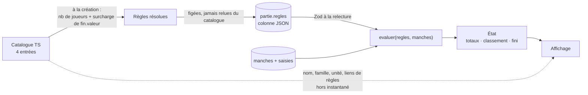

# Configuration déclarative d'un jeu

- **Statut** : acceptée
- **Date** : 2026-08-31
- **Ticket** : [#2](https://github.com/Bryan21B/scoring-sheets/issues/2), sous la carte [#1](https://github.com/Bryan21B/scoring-sheets/issues/1)

## Contexte

Quatre entrées au catalogue, et elles ne s'accordent sur presque rien :

| | Unité de manche | Direction | Fin de partie |
|---|---|---|---|
| 6 qui prend | têtes de bœuf par joueur | le plus bas gagne | 66 têtes |
| 6 qui prend, variante | idem | le plus bas gagne | exactement 2 manches |
| Uno | somme des cartes restantes des autres, au gagnant | le plus haut gagne | 500 points |
| Dnup | 2 jetons au 1er sorti, 1 au 2e, 0 aux autres | le plus haut gagne | 4 jetons — **mais à 2 joueurs, 2 manches gagnées** |

Le cadrage de la carte a tranché qu'un `Jeu` est **une entité portant une
configuration déclarative, lue par un moteur de décompte unique**. Ce document
dit quels champs cette configuration porte, et ce que le moteur en fait.

## Approches comparées

### A — Une stratégie de code par jeu

Une fonction de décompte par entrée du catalogue, sélectionnée par `jeuId`.

Écarté par le cadrage, et pour une raison qui vaut d'être écrite : à quatre
entrées, quatre fonctions se ressemblent à 90 % et divergent silencieusement.
Le cinquième jeu se code en copiant le plus proche, et la logique de « quand la
partie s'arrête » finit écrite quatre fois.

### B — Configuration déclarative paramétrée *(retenue)*

Un objet par entrée. Les axes sur lesquels les quatre jeux diffèrent — direction
du classement, mode de saisie, condition de fin, bornes de joueurs — deviennent
des champs ; les axes sur lesquels ils s'accordent restent dans le moteur.

Chaque champ variable est une **union discriminée close et paramétrée** : les
formes sont connues et limitées, mais chacune porte ses valeurs. `podium` sait
qu'il distribue `[2, 1]` sans que le moteur ne connaisse Dnup.

### C — Un DSL générique de règles

Une description compositionnelle — source de la valeur, cible du crédit,
transformation — capable d'exprimer un jeu jamais vu.

Écarté : c'est un langage de règles pour un catalogue de quatre entrées et une
dizaine d'utilisateurs. Du coût sans client, et un langage qu'il faudrait
documenter, tester et déboguer en plus des jeux eux-mêmes.

## Le flux



Deux chemins partent du catalogue et ne se rejoignent jamais : ce que le moteur
calcule passe par l'instantané et ne dépend plus du catalogue ; ce que l'écran
affiche se relit du catalogue à chaque fois.

## Décision

### La forme

Deux blocs par entrée. Le moteur ne reçoit que `regles` — sa signature interdit
mécaniquement de brancher sur `jeu.id`, et c'est le seul dispositif qui protège
« un moteur unique » contre la première urgence.

Le **schéma Zod est la source**, le type s'en infère (`z.infer`). Schéma, type,
catalogue et moteur vivent dans `src/lib/jeux/` : `AGENTS.md` interdit le type
dupliqué entre modules.

```ts
type Fin =
  | { type: "seuil"; valeur: number }          // valeur ≥ 1
  | { type: "manchesFixes"; valeur: number }
  | { type: "manchesGagnees"; valeur: number };

/** Résolu — ce que le moteur voit, et ce que la partie fige. */
type Regles = {
  classement: { direction: "haut" | "bas" };
  saisie:
    | { mode: "entierParJoueur"; min: 0; max: number }
    | { mode: "sommeAuGagnant"; min: 0; max: number }
    | { mode: "podium"; jetons: readonly number[] };
  fin: Fin;
  joueursMin: number;
  joueursMax: number;
};

type EntreeCatalogue = {
  id: string;                                   // jamais supprimé, jamais renommé
  nom: string;
  famille: string;
  unite: { un: string; plusieurs: string };
  rulesUrl: string | null;
  rulesDigestPath: string | null;
  regles: Regles & { finSelonJoueurs?: Record<number, Fin> };
};
```

`finSelonJoueurs` n'existe **qu'au catalogue**. Deux schémas Zod, donc : celui du
catalogue, et celui des règles résolues. Le moteur ne peut pas voir la surcharge
par nombre de joueurs, parce qu'elle est déjà appliquée quand il reçoit l'objet.

### Le catalogue

| id | direction | saisie | fin | joueurs | unité |
|---|---|---|---|---|---|
| `6-qui-prend` | bas | `entierParJoueur` 0–200 | seuil 66 | 2–10 | tête(s) de bœuf |
| `6-qui-prend-cartes-speciales` | bas | idem, par spread | manchesFixes 2 | 2–10 | tête(s) de bœuf |
| `uno` | haut | `sommeAuGagnant` 0–500 | seuil 500 | 2–10 | point(s) |
| `dnup` | haut | `podium` `[2, 1]` | seuil 4, `{ 2: manchesGagnees 2 }` | 2–5 | jeton(s) |

Les deux premières partagent `famille: "6-qui-prend"`. La variante se déclare par
spread de l'entrée de base — c'est du TypeScript, l'héritage est déjà dans le
langage ; un `parentId` en configuration ajouterait une résolution à faire et une
boucle possible.

Les `max` sont des garde-fous anti-doigt-gras, pas des règles de jeu : assez
larges pour ne jamais refuser une manche vraie, assez serrés pour arrêter un
ordre de grandeur de trop. Refus sec, pas de confirmation — une boîte de dialogue
à la trentième manche de la soirée se tape sans la lire.

`famille` est **déclaré ici et interprété ailleurs** : le palmarès décidera
d'additionner ou de séparer les deux 6 qui prend. Sans ce champ, cette décision
s'écrirait en dur quelque part sous la forme « ces deux ids-là vont ensemble ».

### Le moteur

```ts
evaluer(regles: Regles, manches: Manche[]): Etat

type Etat = {
  totaux: Map<JoueurId, number>;
  manchesGagnees: Map<JoueurId, number>;
  classement: JoueurId[][];   // groupes de rang
  fini: boolean;
  manchesJouees: number;
};
```

Pure, recalculée à chaque lecture. Rien de tout cela n'est stocké.

- **Contrat `saisie brute → points par joueur`.** La configuration décrit une
  *transformation* : à Uno, ce qu'on entre (les cartes restantes de chaque
  perdant) et ce qui est marqué (leur somme, au gagnant) sont deux choses
  différentes.
- **Le franchissement se lit toujours par le total le plus haut**, y compris à
  6 qui prend où l'on accumule des têtes jusqu'à 66 et où le plus bas gagne.
  `direction` ne sert donc **qu'au classement**, jamais au déclenchement : deux
  champs strictement orthogonaux, une seule règle de franchissement.
- **Totaux vivants, fin figée.** Une manche incomplète alimente `totaux` — trois
  joueurs sur cinq ont saisi, les compteurs bougent déjà — mais elle ne compte ni
  dans `manchesJouees` ni dans `manchesGagnees`, et ne peut **jamais** rendre
  `fini` vrai. On voit le seuil arriver ; la partie ne ferme qu'à la clôture de
  la manche, quand tout le monde a été saisi.
- **La complétude est dérivée du mode de saisie**, ce n'est pas un champ :
  `entierParJoueur` → tous les joueurs ont une valeur ; `sommeAuGagnant` → un
  gagnant désigné et une valeur pour chacun des autres ; `podium` → un premier et
  un deuxième désignés.
- **Le gagnant d'une manche est dérivé**, jamais saisi, et défini pour les trois
  modes : `podium` → le premier ; `sommeAuGagnant` → le gagnant désigné ;
  `entierParJoueur` → le meilleur score de la manche selon `direction`. Égalité
  sur une manche → personne ne la gagne.
- **`classement` est toujours calculable**, même à zéro manche et même si `fini`
  est faux : le podium consultable en cours de partie n'est pas un mode
  particulier, c'est la sortie normale du moteur affichée plus tôt.
- **`fini`, pas `gagnant`.** Le moteur dit que la condition est remplie et donne
  l'ordre ; il ne nomme pas de vainqueur. Le classement en **groupes de rang**
  (`JoueurId[][]`) rend l'égalité irreprésentable autrement : on ne *peut pas*
  écrire un consommateur qui l'oublie, là où une liste plate afficherait un
  podium faux sans que rien ne proteste. Deux joueurs à égalité sont ex æquo,
  partout, sans départage.

### La persistance

**Pas de table `jeux`.** `partie.jeuId` est une colonne texte, validée par Zod
contre les ids du catalogue à l'écriture.

La partie stocke l'**instantané complet** des règles résolues — surcharge et
`finSelonJoueurs` déjà appliquées. C'est le seul rempart contre une édition
rétroactive : le catalogue vit dans une constante TypeScript, éditable sans
migration, et rien d'autre n'empêcherait une correction de barème de réécrire
des parties terminées qui nourrissent le palmarès et un futur classement Elo.

Le prix, assumé : **une correction de barème ne rattrape pas les parties en
cours**, elles finissent sous les règles qui les ont ouvertes.

La présentation — `nom`, `famille`, `unite`, liens de règles — n'est **pas** dans
l'instantané : elle se résout depuis le catalogue à l'affichage. D'où la règle
qui va avec, gelée par un test : **un id de catalogue ne se supprime ni ne se
renomme jamais**, sinon une partie de l'an dernier perd son nom.

Le nombre de joueurs est lu **une fois, à l'ouverture de la partie**. Sans cela,
un joueur qui arrive ou s'en va ferait basculer la condition de fin en plein jeu.

### Surcharge par partie

`fin.valeur` seulement — « ce soir on s'arrête à 30 ». Entier ≥ 1, pas d'autre
borne : 30 et 200 sont deux soirées valides, 0 n'en est pas une.

Chaque champ ouvert de plus serait un contrôle de plus sur un écran qu'on
traverse debout, une main tenant les cartes, et rendrait l'historique plus
difficile à agréger : deux parties du même jeu aux règles différentes ne se
comparent plus.

### Bornes de joueurs et validation

**Plancher et plafond durs** : la création est refusée hors de
`[joueursMin, joueursMax]`.

**Un seul point de contrôle : la saisie.** Un schéma Zod dérivé de `regles.saisie`
refuse à la frontière d'API, conformément à `AGENTS.md`. Pas de contrainte
`CHECK` par jeu sur les points : SQLite ne voit pas la configuration, il faudrait
y recopier les bornes, et une borne recopiée dérive de son original.

À noter — pour Dnup, l'ensemble `{0, 1, 2}` n'est **jamais une saisie** : on
désigne un premier et un deuxième, les jetons sont un résultat. « Borner une
valeur de manche » recouvre donc deux choses, et une seule est vérifiable en
amont.

## Conséquences

- Le moteur est testable sans base : `evaluer` est pure et ne prend que des
  données. Les quatre entrées du catalogue en sont les quatre jeux d'essai.
- Ajouter un jeu est une entrée dans une constante et zéro migration. Ajuster un
  barème aussi — c'est ce que la table `jeux` aurait coûté.
- `jeuId` n'a aucune intégrité référentielle au niveau SQLite : une écriture
  directe en base pourrait y mettre n'importe quoi. Relâchement assumé à dix
  utilisateurs sans accès direct à la base.
- Le catalogue n'est pas validé par Zod à la déclaration — c'est du code, le
  compilateur le garde. L'instantané relu depuis le JSON, lui, l'est.

## Ce qui n'est pas décidé ici

- Le grain des tables et ce qui est indexé → [#15](https://github.com/Bryan21B/scoring-sheets/issues/15).
- Les états d'une partie, la correction après clôture, le joueur qui s'en va →
  [#13](https://github.com/Bryan21B/scoring-sheets/issues/13). Plus de règle de
  départage à y concevoir : reste ce qu'une victoire partagée fait au palmarès.
- Additionner ou séparer les deux 6 qui prend au palmarès → [#14](https://github.com/Bryan21B/scoring-sheets/issues/14).
- Les valeurs de `rulesUrl` et `rulesDigestPath` → [#6](https://github.com/Bryan21B/scoring-sheets/issues/6) et [#7](https://github.com/Bryan21B/scoring-sheets/issues/7).
- La ligne à ajouter dans `AGENTS.md` § Code style — « quand un type et son
  schéma Zod décrivent la même donnée, le schéma est la source » → [#16](https://github.com/Bryan21B/scoring-sheets/issues/16).
