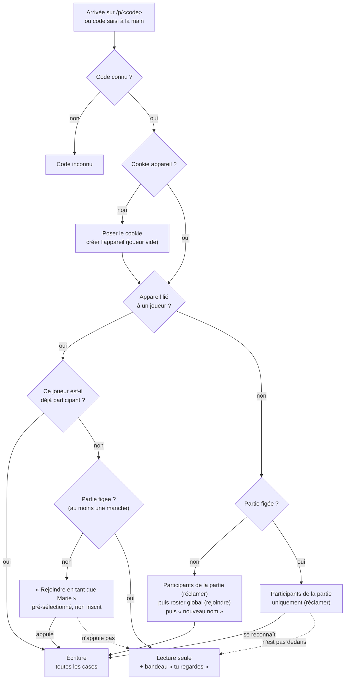

# Identité, lien de partage et arrivée dans une partie

- **Statut** : acceptée
- **Date** : 2026-08-31
- **Ticket** : [Identité, lien de partage et arrivée dans une partie](https://github.com/Bryan21B/scoring-sheets/issues/3), sous la carte [Carte — feuille de score multi-appareils pour 6 qui prend, Uno et Dnup](https://github.com/Bryan21B/scoring-sheets/issues/1)

## Contexte

Le cadrage de la carte a tranché qu'il n'y a **aucune authentification** : un lien
de partage par partie, non devinable, et on rejoint en se choisissant dans une
liste déroulante du roster global. Il a aussi posé que **n'importe quel joueur
ayant rejoint peut écrire n'importe quelle case** — les règles d'Uno et de Dnup
l'imposent, c'est une personne qui compte pour tout le monde — et que le lien
appareil → joueur est une **déclaration, pas une preuve**.

Ce document dit comment on rejoint une partie, et qui l'app croit qu'on est.

Il bloquait [Journal d'audit : ce qu'une ligne contient et quand elle s'écrit](https://github.com/Bryan21B/scoring-sheets/issues/11) : « qui » n'a pas de sens
tant que l'identité n'est pas posée.

## Approches comparées

### A — Identité par partie

Le cookie ne porte qu'un identifiant d'appareil opaque ; le lien vers un joueur
est stocké par partie. Un même appareil peut être Marie dans une partie et Paul
dans une autre.

Écarté. Ça modélise honnêtement le téléphone posé au milieu de la table, mais au
prix de redemander « qui es-tu ? » à chaque nouvelle partie — c'est-à-dire de
réintroduire à chaque soirée la friction que le roster persistant existe pour
supprimer. Et le cas qu'elle achète est déjà couvert autrement : le téléphone
partagé n'a pas besoin de changer d'identité, puisque n'importe qui peut écrire
n'importe quelle case.

### B — Identité d'appareil globale *(retenue)*

Un appareil **est** une personne, partout. Le lien `appareil → joueur` est unique
et global ; le changer vaut vers l'avant seulement.

L'identification est payée **une seule fois dans la vie de l'appareil**. Le
téléphone au milieu de la table reste le téléphone de Marie : c'est Marie qui
saisit pour tout le monde, et l'audit dit « l'appareil de Marie a saisi le score
de Paul » — ce qui est vrai, et c'est l'information utile.

### C — Comptes et authentification

Écartée au cadrage, rappelée ici pour mémoire : une dizaine d'amis, un enjeu
nul, et un mot de passe à retenir pour tenir les scores d'une belote.

## Le flux d'arrivée

## Décision

### L'identité d'appareil

Le lien `appareil → joueur` est **global** : un appareil est une personne,
partout, jamais par partie. **Plusieurs appareils peuvent pointer le même
joueur** — téléphone et tablette — et aucun ne délie les autres.

C'est un **pointeur au présent**. Quand Marie dit « ce n'est plus mon
téléphone », il pointe ailleurs, **vers l'avant seulement** : le passé n'est pas
relu. D'où la contrainte imposée à l'audit — il stocke le `joueurId` **résolu au
moment de l'écriture**, jamais un renvoi vers ce que l'appareil est aujourd'hui.
Sinon délier un téléphone réécrirait tout son passé.

Le lien reste une **déclaration, pas une preuve**.

### La persistance : un cookie serveur, et rien d'autre

| | |
|---|---|
| Nom | `appareil` |
| Valeur | identifiant **opaque** (nanoid 21) — le lien vers le joueur vit en base |
| Drapeaux | `HttpOnly` `Secure` `SameSite=Lax` |
| Durée | `Max-Age` 400 jours, **réémis à chaque requête** |
| Pose | dès le premier chargement, avant toute identification |

`HttpOnly` parce que le JS n'en a jamais besoin, et que ça le met hors d'atteinte
du plafond de 7 jours d'ITP, qui ne frappe que le stockage écrit côté client. Un
`Set-Cookie` serveur n'a **aucun plafond sur Safari iOS** ; les 400 jours viennent
de Chrome et Firefox, et la réémission remet le compteur à zéro partout.

`SameSite=Lax` est load-bearing : arriver depuis un lien partagé par messagerie
est une navigation cross-site. `Strict` n'enverrait pas le cookie et l'appareil
paraîtrait inconnu **précisément dans le parcours principal**.

### Pas de fingerprinting

Question ouverte à l'ouverture du ticket, refermée par la recherche. Trois
raisons, dans l'ordre de force :

1. **Ça dégraderait le stockage qu'on cherche à protéger.** Safari 26
   (septembre 2025) ajoute *Script Tracking Privacy* : les scripts reconnus comme
   empreintes se voient randomiser canvas, audio et `hardwareConcurrency`, et
   Safari **leur interdit d'écrire du stockage persistant, cookies et
   `localStorage` compris**. La liste est maintenue côté Apple et comporte des
   entrées « first-party » — un script servi depuis notre propre domaine peut y
   tomber. On n'y gagnerait pas un identifiant, on en perdrait un.
2. **La stabilité est nulle, pas dégradée.** Sous protection avancée — dont la
   navigation privée, par défaut — la graine de bruit WebKit est régénérée à
   chaque démarrage.
3. **L'entropie ne suffit pas à notre cas.** Hors protection, environ 10 à 15 bits
   exploitables sur iPhone : User-Agent gelé pour tous les iPhone, pas
   d'énumération de polices, `hardwareConcurrency` à 4 ou 8. Insuffisant pour
   distinguer deux iPhone du même modèle — c'est-à-dire exactement notre cas.
   Et sur iOS il n'y a pas d'échappatoire : tous les navigateurs sont WebKit.

**Appareil non reconnu** — navigation privée, cookies effacés, téléphone neuf :
aucun traitement particulier. C'est un appareil vierge, il se rechoisit dans la
liste. Un nouvel `appareil` pointe vers Marie, l'ancien continue de pointer vers
Marie : c'est le multi-appareils, aucune fusion ni ménage. Coût réel d'une perte
de cookie, **un geste, une fois** — précisément ce que le fingerprinting
promettait d'économiser et ne sait pas tenir.

### Le code de partie

**Un seul identifiant**, présent dans `/p/<code>` et saisissable à la main dans
« rejoindre une partie » : la même chaîne dans les deux cas.

- **Crockford Base32, 6 caractères** (`0123456789ABCDEFGHJKMNPQRSTVWXYZ`, sans
  `I`, `L`, `O` ni `U`). Choisi pour être **dicté à voix haute** : pas de
  confusion `O`/`0` ni `I`/`1`/`L`, et la casse est indifférente.
- **Normalisation à la saisie** : minuscules acceptées, `O`→`0`, `I`/`L`→`1`.
- **Unicité en base**, boucle de régénération sur collision.
- **Jamais recyclé.** Un vieux lien doit afficher « cette partie est terminée »,
  jamais la partie de quelqu'un d'autre.
- **Limite de débit** sur la recherche par code. 2³⁰ combinaisons pour quelques
  centaines de parties, c'est une chance sur un million par tirage aveugle —
  négligeable en enjeu, mais un script en fait un million sans transpirer.
- **Visible de tous les participants**, pas du seul créateur : ce n'est pas
  toujours lui qui a son téléphone en main quand quelqu'un arrive.
- **Pas de caractère de contrôle** en 7ᵉ position : la base dit déjà que le code
  est faux.

Le code **n'est pas la clé primaire** : `partie.id` interne, `partie.code` en
colonne unique indexée à côté, pour pouvoir régénérer un lien sans casser les
références.

**Ce qu'il autorise : la lecture.** L'**écriture** est conditionnée à être
participant — payé une seule fois dans la vie de l'appareil, puisque le lien est
global. Un seul jeton, pas deux : un deuxième lien serait surtout un lien qu'on
envoie par erreur.

### Réclamer et rejoindre : deux gestes distincts

C'est la charnière du parcours, et elle sort de la combinaison entre « le
créateur peut ajouter des joueurs sans appareil » et « la liste se fige ».

- **Réclamer** — lier l'appareil à un participant **déjà présent** dans la
  partie. N'ajoute personne à la liste, donc **autorisé même partie figée**.
- **Rejoindre** — **ajouter** un participant. **Interdit dès le gel.**

Sans cette distinction, Paul — ajouté par Marie à la création, puis ouvrant le
lien après la manche 1 — serait spectateur de sa propre partie.

### L'arrivée

- **Créer une partie, c'est y être.** Choisir le jeu → « qui es-tu ? » (liste +
  « nouveau nom ») → la partie existe avec toi dedans, et le code s'affiche.
- **Le créateur peut ajouter des joueurs sans appareil.** Ils existent comme
  participants sans lien appareil → joueur, et réclameront leur place s'ils
  ouvrent le lien. Le mode « un seul téléphone au milieu de la table » est donc
  pris en charge de plein droit.
- **Appareil connu, joueur non participant, partie ouverte** : « Rejoindre en
  tant que **Marie** », **pré-sélectionné et non inscrit**. Le bouton est armé,
  un geste pour entrer, mais **rien n'est écrit tant qu'on n'appuie pas** —
  c'est ce qui rend le spectateur possible. Le nom est cliquable pour changer.
- **Appareil vierge** : la liste montre d'abord les **participants de la partie**
  (réclamer), puis le reste du **roster global** (rejoindre), puis « nouveau
  nom ». Sur une partie figée, seuls les participants sont proposés.
- **Roster vide** (premier lancement) : aucun cas particulier. Une liste vide est
  une liste vide, et le champ « nouveau nom » est toujours affiché à côté.

### Le gel de la liste

**La liste des participants se fige à la première manche saisie.** Pas de bouton
« démarrer » : c'est un écran de cérémonie qui n'existe que pour être cliqué, et
le gel se déduit de l'existence d'une manche sans demander de colonne d'état.

Tant qu'aucun score n'existe, la partie est en salle d'attente : on ajoute, on
**retire** — appareil lié compris, l'appareil retourne simplement à l'état « peut
rejoindre » — et on se choisit.

**Rejoindre en cours de partie est impossible.** Prix assumé : si on réalise
après la manche 1 que Paul n'a jamais été ajouté, il faut supprimer la manche 1,
ajouter Paul, ressaisir. L'alternative — des manches antérieures vides — a été
écartée, notamment parce qu'une case vide n'est pas un zéro : à *6 qui prend* le
plus bas gagne, entrer à zéro donnerait un avantage écrasant ; à Uno, un
handicap. Si ce détour coûte trop cher une fois confronté au réel, c'est
l'interdiction qu'il faut rouvrir, pas le moment du gel.

### Le spectateur

Ce n'est pas une option offerte, c'est **mécanique** : dès qu'une partie est
figée, toute personne ayant le code et n'y participant pas est spectatrice.

Un seul état à coder — *a le code, n'est pas participant* → **lecture seule avec
un bandeau qui dit pourquoi** (« Tu regardes cette partie, tu n'y joues pas »).
Il couvre le spectateur volontaire comme le retardataire. Ni refus sec —
regarder une partie où on ne joue pas est parfaitement normal entre amis — ni
cases inertes sans explication, qui produisent des gens convaincus que l'app est
cassée.

### Le roster global

- **Aucune contrainte d'unicité sur le nom.** Deux personnes peuvent vraiment
  s'appeler Marie ; refuser serait faux.
- **Désambiguïsation forcée dans l'UI.** Taper un nom qui existe ne bloque pas :
  « Marie existe déjà. C'est elle, ou une autre Marie ? » Si c'est une autre,
  l'app réclame un nom distinctif (« Marie B. ») avant de créer. Pas de suffixe
  automatique « Marie (2) » — c'est l'humain qui tranche, parce que c'est lui qui
  relira la liste.
- **Renommer est autorisé**, propagation partout comprise, y compris dans les
  parties passées et l'audit. Ce que « on ne réécrit pas le passé » protège,
  c'est le **lien** appareil → joueur, pas l'**étiquette** : c'est le même humain
  qui a fait la même chose, écrire son nom correctement ne réécrit rien.
- **Fusionner ou supprimer un joueur reste hors v1** — ça, ce serait réécrire.
  Mais le schéma ne doit pas l'interdire.

## Conséquences

- **[Journal d'audit](https://github.com/Bryan21B/scoring-sheets/issues/11) est débloqué.** Le « qui » est le `joueurId` résolu au
  moment de l'écriture. Le journal ne dit pas qui a agi : il dit ce que l'app a
  cru, et c'est une propriété à assumer dans la formulation affichée.
- **[Modèle de domaine et schéma Drizzle](https://github.com/Bryan21B/scoring-sheets/issues/15) reçoit deux relations distinctes** — `appareil →
  joueur` (globale) et `participation (partie, joueur)`, un participant pouvant
  n'avoir aucun appareil — et l'interdiction de **dénormaliser un nom** hors de
  la table `joueur`, pour ne pas fermer la porte à une fusion de doublons.
- **Politique de référent restrictive sur les pages de partie.** Le code vit dans
  l'URL et le lien « règles complètes » sort vers l'éditeur : sans ça, le code de
  la partie part dans l'en-tête `Referer` au premier clic.
- **Aucune dépendance ajoutée** pour l'identité.

## Ce qui n'est pas décidé ici

- **L'accès en lecture à une partie terminée**, et pour combien de temps →
  [Cycle de vie d'une partie](https://github.com/Bryan21B/scoring-sheets/issues/13) et [Historique et palmarès](https://github.com/Bryan21B/scoring-sheets/issues/14).
- **Où le code s'affiche à l'écran**, et le geste de partage →
  [Accueil, création d'une partie et arrivée](https://github.com/Bryan21B/scoring-sheets/issues/9).
- **Le manifeste écran d'accueil** → [Accueil, création d'une partie et arrivée](https://github.com/Bryan21B/scoring-sheets/issues/9), et pour l'icône, pas
  pour l'identité : l'exemption ITP permanente d'une web app installée ne protège
  que le stockage écrit en JS, dont on n'écrit aucun.
- **Fusionner deux joueurs** créés en double, et **supprimer** un joueur du
  roster. Hors v1, mais le schéma ne doit pas les interdire.
- **Un `Groupe` d'amis** si le roster global devient bruyant. Additif.
