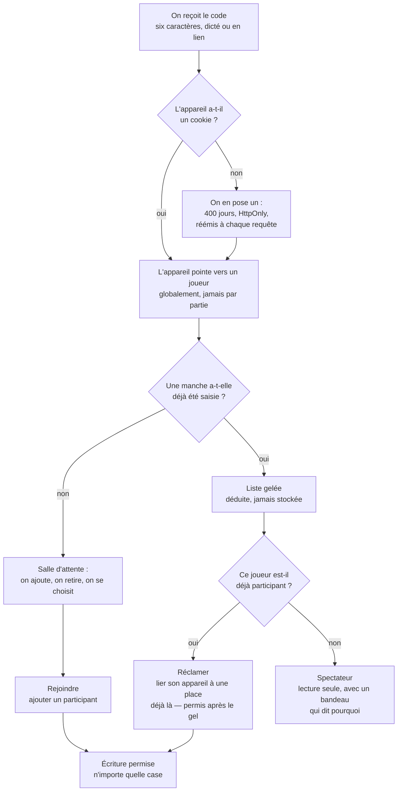

# Feuille de score — le design consolidé

- **Statut** : acceptée — ferme la carte
- **Date** : 2026-09-09
- **Ticket** : [Design doc consolidé, CONTEXT.md et ADR](https://github.com/Bryan21B/scoring-sheets/issues/16), sous la carte [Carte — feuille de score multi-appareils pour 6 qui prend, Uno et Dnup](https://github.com/Bryan21B/scoring-sheets/issues/1)

## Ce qu'on construit

Une feuille de score **mobile-first** pour des parties de cartes entre amis. Une
dizaine d'utilisateurs, cinq téléphones autour d'une table, quatre entrées au
catalogue : *6 qui prend*, sa variante *cartes spéciales*, *Uno*, *Dnup*.

On ouvre une partie, on dicte un code à la table, chacun rejoint, et on saisit
manche par manche jusqu'à ce que quelqu'un franchisse le seuil. Les scores
apparaissent sur tous les téléphones sans rechargement.

**À la fermeture de ce document, il ne reste aucune décision ouverte.** Ce qui
suit est constructible.

## Où vit quoi

Ce document consolide ; le détail vit ailleurs et n'est jamais recopié.

| Sujet | Détail |
|---|---|
| Le glossaire, seul faisant foi sur les noms | `CONTEXT.md` |
| Catalogue, règles, moteur | `docs/specs/2026-08-31-configuration-de-jeu.md` |
| Partage, identité, arrivée | `docs/specs/2026-08-31-identite-et-arrivee.md` |
| Journal d'audit | `docs/specs/2026-09-09-journal.md` |
| Écriture concurrente | `docs/specs/2026-09-09-ecriture-concurrente.md` |
| Cycle de vie d'une partie | `docs/specs/2026-09-09-cycle-de-vie.md` |
| Historique et palmarès | `docs/specs/2026-09-09-historique-et-palmares.md` |
| Tables, index, invariants | `docs/specs/2026-09-09-schema.md` |
| Transport temps réel, mesuré | `docs/research/2026-08-31-transport-temps-reel.md` |
| Formule de classement, mesurée | `docs/research/2026-09-04-classement-multijoueur.md` |
| Règles imprimées, condensées | `docs/regles/` |

Quatre décisions ont mérité un ADR : `0003` le transport, `0004` l'identité,
`0005` la configuration déclarative, `0006` la fin estampillée.

## 1. Le catalogue et le moteur

Trois approches se présentaient pour porter quatre jeux qui ne diffèrent que sur
quatre axes.

| | Ce que c'est | Pourquoi pas |
|---|---|---|
| **A** | une stratégie en code par jeu | le 5e jeu se code en copiant le plus proche, et « quand la partie s'arrête » finit écrit quatre fois |
| **B** *(retenue)* | une configuration déclarative paramétrée | — |
| **C** | un DSL générique de règles | un langage à documenter, tester et déboguer, pour quatre entrées |

Un **jeu** est une entité portant des **règles** : direction du classement, mode
de saisie, condition de fin, bornes de joueurs. Chaque champ est une **union
discriminée close et paramétrée**.

Le **moteur de décompte** est unique et **pur** : `evaluer(regles, manches)` ne
reçoit que des données. Ce qui n'est pas dans `regles` ne peut pas influencer un
calcul.

**Pas de table `jeux`.** Le catalogue est une constante TypeScript, et la partie
fige un **instantané complet des règles résolues** à son ouverture. C'est le seul
rempart contre une édition rétroactive : sans lui, corriger un barème réécrirait
des parties passées.

Le **classement** que le moteur produit est un ordre en **groupes de rang**.
L'égalité n'est **jamais** départagée, nulle part, et le type le rend
irreprésentable autrement : on ne peut pas écrire un consommateur qui l'oublie.

Voir `docs/adr/0005-configuration-declarative-de-jeu.md`.

## 2. Le partage et l'identité

**Aucune authentification.** Un lien de partage par partie, un code de six
caractères en Crockford Base32 fait pour être **dicté à voix haute**.



Deux gestes distincts, et c'est le **gel** qui les sépare. *Rejoindre* **ajoute**
un participant, donc devient interdit dès la première manche. *Réclamer* n'ajoute
personne, donc reste permis. Le **spectateur** n'est pas une option offerte, c'est
la conséquence du gel.

Le gel se **déduit** de l'existence d'une manche ; il ne se stocke pas. Supprimer
la manche 1 **dégèle** donc la liste, ce qui est le détour prévu quand on a oublié
quelqu'un.

### Le lien appareil vers joueur est une déclaration, pas une preuve

**Cette phrase doit survivre à tout le reste.**

Le journal dit « cet appareil, se déclarant Marie, a changé cette case ». Il ne
dit pas que Marie l'a fait, et **il ne peut pas**. N'importe qui peut repointer son
appareil vers n'importe quel joueur, à tout moment.

Il en découle que **le journal d'audit n'est pas un contrôle de sécurité**, que le
**code de partie n'est pas un secret** — il est court exprès —, et qu'**aucune
fonctionnalité future ne doit s'appuyer sur cette identité comme sur une
autorisation**. L'anomalie qu'on cherche entre amis est une erreur de frappe,
jamais une fraude.

Voir `docs/adr/0004-identite-declarative-sans-authentification.md`.

## 3. Saisir une manche

Trois maquettes ont été construites et départagées.

| | La forme | Le verdict |
|---|---|---|
| **A** | la liste : cinq joueurs visibles, une ligne chacun | sa forme d'ensemble revient au récapitulatif |
| **B** *(retenue pour saisir)* | un joueur à la fois, plein écran, pavé maison ouvert | c'est l'écran qu'on ouvre trente fois dans une soirée |
| **C** | la grille entière, manches en lignes | trop de défilement latéral pour saisir ; devient la fiche de partie |

**La passe avant** est séquentielle, un écran à la fois : les **désignations**
d'abord, puis les **valeurs**. Elle ne montre **aucun total et aucune alerte**, et
n'a donc rien à rafraîchir — **elle ne poll pas**, ce qui règle la question « ma
valeur est-elle remplacée pendant que je tape ».

Elle **démarre sur soi et s'arrête là**. Un écran, pas cinq.

Deux espèces de gestes suffisent à décrire les trois jeux, et **qui saisit quoi ne
se déclare nulle part** : cela se dérive de leur forme.

| Entrée | Ce que la manche demande | Distribuée ? |
|---|---|---|
| 6 qui prend et sa variante | *n* valeurs, une par joueur | oui |
| Uno | une désignation, puis un total unique | non |
| Dnup | deux désignations, aucun nombre | non |

**Le récapitulatif** est la suite de la passe avant. Il porte les totaux, les cases
encore vides **nommées** par le joueur qu'elles concernent, et la correction —
**corriger est le même geste que saisir**. C'est de là qu'on saisit pour un
participant sans appareil.

**Clore la manche est une déclaration**, faite par n'importe quel participant sur
une manche **complète** seulement. C'est là, et pas avant, que l'alerte de seuil
part.

## 4. La synchronisation, et le conflit

Le transport a été mesuré contre six alternatives.

| | Latence | Pièces ajoutées | Pourquoi pas |
|---|---|---|---|
| **Polling 3 s** *(retenu)* | ≤ 3 s | aucune | — |
| SSE / WebSocket | ≤ 1 s | reconnexion toutes les 5 min | Turso ne pousse rien, donc SSE **déplace** le poll au lieu de le supprimer |
| Pusher, Ably | < 1 s | compte, secret, SDK | garde-les en plan B, en signal de réveil |
| Supabase, Liveblocks | < 1 s | une seconde base, ou un modèle de collaboration | mise en pause après inactivité, plafond de minutes |

```mermaid
sequenceDiagram
  autonumber
  participant A as Téléphone de Bryan
  participant S as Server Action
  participant D as Turso
  participant B as Téléphone de Léa

  Note over B: le récapitulatif poll ; la passe avant, non
  loop toutes les 3 s
    B->>S: lire la version de la partie
    S->>D: une ligne indexée
    D-->>B: inchangée, on ne fait rien
  end

  Note over A: useOptimistic affiche 12 tout de suite
  A->>S: écrire (manche 3, Paul) = 12
  S->>D: UPDATE ... WHERE valeur = celle qui m'a été montrée

  alt la case n'a pas bougé
    D-->>S: une ligne touchée
    S->>D: ligne de journal, et version + 1
    S-->>A: accepté
  else quelqu'un est passé avant
    D-->>S: zéro ligne touchée
    S-->>A: refusé, avec la valeur arrivée
    Note over A: le 12 recule, un écran montre le 8<br/>et garde le 12 pour le réappliquer
  end

  B->>S: lire la version
  S-->>B: changée, donc router.refresh()
```

**Il n'y a aucune présence.** Personne ne sait qui est connecté ni qui saisit : un
verrou d'édition est **irréalisable**, pas seulement écarté. Le conflit se tranche
donc **au serveur, à l'écriture**.

**Le garde-fou porte sur la case, jamais sur la partie.** Cinq joueurs saisissant
chacun leur case sont le cas **normal** à 6 qui prend ; une condition portée par la
partie en ferait échouer quatre. L'estampille de version reste au poll, et n'est
jamais un jeton d'écriture.

La règle tient en une phrase : **une case ne s'écrit qu'à condition de porter
encore la valeur qui a été montrée**, le vide étant une valeur. Un écrasement
**informé** passe et se trace ; seul l'écrasement **périmé** est refusé.
L'interface arrête ce qui repose sur une information fausse, le journal garde ce
qui repose sur une information vraie.

Trois idempotences ferment le reste : une écriture **sans effet** réussit en
silence, **clore** deux fois ne fait rien, et une manche étant unique par partie et
par numéro, une seconde création **rejoint** la première.

Voir `docs/adr/0003-polling-plutot-que-push.md`.

## 5. Le cycle de vie

Une partie porte une **fin**, absente ou présente. Il n'y a pas de statut à trois
valeurs.

| État | Ce qu'on peut y faire |
|---|---|
| **En cours** — pas de fin | tout |
| **Terminée** | rien : elle est **scellée** |
| **Abandonnée** | la **reprise**, et rien d'autre |

**Une partie terminée est scellée, définitivement.** Le prix est assumé : une
erreur découverte le lendemain y reste, et le palmarès la portera. Le seul recours
est de corriger **avant** de clore la manche qui termine la partie, ce que le
récapitulatif rend précisément possible.

**L'abandon est le balai.** L'accueil *étant* la partie en cours, une partie morte
squatterait l'écran principal, et la seule autre sortie serait la suppression, qui
détruirait le journal. La **reprise** l'efface, pour une partie abandonnée
seulement.

Une partie ne se **supprime** que tant que son journal est vide. Passé la première
manche, l'invariant du journal l'emporte.

**Le joueur qui s'en va** est retirable après le gel : ses valeurs restent, il sort
de la complétude des manches suivantes **et du classement final**. Sans ce dernier
point, partir tôt ferait gagner à 6 qui prend, où le plus bas l'emporte.

## 6. Le journal

Une **ligne** enregistre un **geste** sur une **case**, avec le **joueur agissant
figé à l'écriture** et l'appareil gardé à côté. Sans ce gel, repointer son
téléphone réécrirait tout l'historique de ses lignes.

Sept gestes : `saisie`, `correction`, `suppressionDeManche`, `participantAjoute`,
`participantRetire`, `abandon`, `reprise`. Les deux derniers ne portent pas de case
— ce sont les seuls qui changent **ce que les autres ont le droit de faire**.

**Append-only, jamais purgé**, tenu par des déclencheurs SQLite. Écrit **dans la
même transaction** que la mutation, dont l'échec fait échouer la mutation. Lecture
ouverte à quiconque peut lire la partie, spectateurs compris ; le tiroir `⋯` montre
par défaut les seules corrections et suppressions.

Ce n'est **pas une source de vérité** : le moteur ne le lit jamais.

## 7. L'historique et le palmarès

Quatre pages qui sont **deux paires** — une liste mène à une fiche.

L'**historique** liste les parties, la plus récente d'abord par date de fin,
filtrable par jeu ; une partie abandonnée y figure, marquée. La **fiche de partie**
est la grille complète, manche par manche.

Le **palmarès** liste les joueurs, ordonné par **taux de victoires normalisé**,
`(battus + 0,5 × ex æquo) / (n − 1)` moyenné sur les parties terminées, avec le
nombre de parties à côté. Sous un plancher, le joueur est **hors classement**.

La **note** — une seule par joueur, `openskill` en Plackett-Luce — **vient après la
v1** et s'ajoutera comme une colonne. La recherche a montré que le taux de
victoires fait aussi bien que les trois formules sur un calendrier équilibré ; ce
qui sauve la formule, c'est le calendrier déséquilibré d'un vrai cercle d'amis.

La **fiche de joueur** porte les **compteurs par entrée**, groupés sous leur
famille avec un sous-total : un compteur est un **fait**, insensible au découpage,
et défini même pour une entrée sans score comme Dnup.

**Les parties abandonnées ne pèsent sur aucun agrégat.**

Trois mots à ne pas confondre : le **classement** est l'ordre dans **une** partie,
la **note** est l'estimation globale d'un joueur, le **palmarès** est la page.

## 8. Le schéma en un coup d'œil

Sept tables : `joueur`, `appareil`, `partie`, `participant`, `manche`, `saisie`,
`journal`.

**Rien de ce que le moteur calcule n'est stocké** — à une exception délibérée, la
**fin d'une partie**, estampillée dans la transaction qui la provoque parce que
sans elle l'historique et le palmarès cesseraient d'être des requêtes SQL. Le
scellement garantit qu'elle ne peut pas diverger. Voir
`docs/adr/0006-la-fin-de-partie-est-estampillee.md`.

Le **grain de `saisie`** — une ligne par manche et joueur — est imposé par
l'écriture concurrente, pas seulement par les manches partielles. Une seule colonne
`valeur`, dont le **mode de saisie** donne le sens.

Détail complet, index et invariants compris, dans
`docs/specs/2026-09-09-schema.md`.

## 9. Hors périmètre

Décidé, et à ne pas rouvrir sans redessiner la destination.

- **Hors-ligne, PWA, service worker** — sur une feuille partagée en direct, cela
  veut dire journal d'opérations et réconciliation, un problème de systèmes
  distribués qui mangerait tout le chantier.
- **i18n** — l'interface est en français.
- **Authentification, comptes, mots de passe** — voir l'ADR `0004`.
- **Héberger les PDF de règles** — repo public, copyright éditeur. On pointe vers
  l'éditeur, et un digest court vit dans `docs/regles/`.
- **Application native** — le web mobile-first est la cible.
- **Un moteur de règles générique** au-delà de la configuration déclarative.

## 10. Par où commencer

Le découpage en tickets d'implémentation ne fait pas partie de ce document. Mais
l'ordre est contraint par une seule dépendance dure, et autant l'écrire :

1. **`src/db/schema.ts`** d'après le spec du schéma, puis `bun run db:generate`, le
   SQL commité sans être touché, et `tests/unit/db.test.ts` étendu pour
   **attester** les tables.
2. **Le moteur**, pur et testable sans base, avec les quatre entrées du catalogue
   pour jeux d'essai.
3. **Tout le reste**, qui dépend de l'un ou de l'autre.
